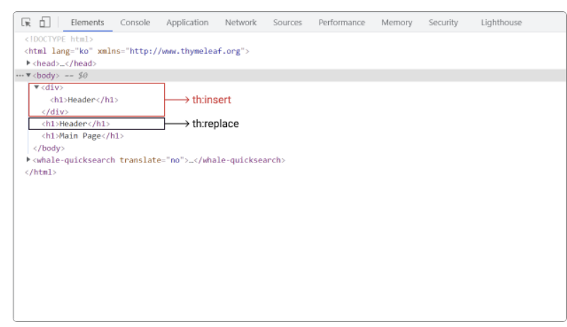

# 23-2-2 Change SpringBoot From Spring- Day 01

## jsp(JSTL) -> html (thymeleaf)

### 다국어 처리

- Spring(Jsp)
  - `<spring:message code="label.product.prod.type.list"/>`

- ``

### Thymeleaf # 문법

1) 숫자 처리
   - 정수형 :  `th:text="${#numbers.formatInteger(x,3,'COMMA')}"` 등
2) 날짜 처리
   - `th:text ="${#dates.~}"`
3) 문자열 처리
   - `th:text="${#strings.~}"`
4) 메시지, 다국어처리
   - `th:text="${#messages.msg(~)}"`

### Thymeleaf Layout

- th:fragment
  - `th:fragment="header"`
  - 템플릿 조각을 선언하고 조각의 네이밍을 붙인다.
-  th:insert
  - `th:insert="~{경로 :: 템플릿조각 이름}"`
  - 작성된 태그 내부에 import하는 템플릿 조각을 추가
-  th:replace
  - `th:replace="~{경로 :: 템플릿조각 이름}"`
  - 작성된 태그를 삭제하고 템플릿 조각으로 대체

