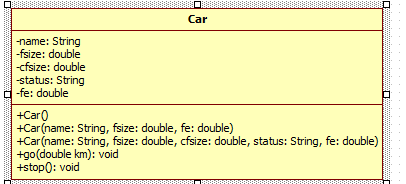

# 4/15 Java Day7

> 객체지향언어와 절차지향언어의 차이 알아보자 (day1)
> ex. C (절차 지향 프로그래밍) VS JAVA (객체 지향 프로그래밍)

## Ch06 클래스

### I) 객체 지향 프로그래밍

- 순서
  - 요구 사항 정의
  - OOAD (Object Oriented Analysis and design) - UML (설계방식) 
  - OOP (Object Oriented Programming) - JAVA
  - 부품 객체를 먼저 만들고 이것들을 하나씩 조립해 완성된 프로그램을 만드는 기법

> 살만한 책  *java(OOP) Design Pattern : 헤드퍼스트 디자인패턴 - 한빛미디어*

#### I-1) OOP 특징 -> 자바

1. Encapsulation (캡슐화)
   - private
3. Inheritance (상속)
4. Polymorphism (다형성)
5. Abstraction (추상적)

#### I-2) 객체란?

- 물리적으로 존재하는 것
- 자신의 속성과 동작을 가지는 모든 것
- 객체는 필드(속성)과 메소드(동작)로 구성된다.

#### I-3) 객체간의 관계

- 관계의 종류

  - 집합 관계
  - 사용 관계
  - 상속 관계

- 클래스의 속성

  - Attribute (속성)

  - Constructor (생성자)

    - Source -> generate constructor using field

  - Operation (동작)

  - Ex. 차

    ```java
    public class Car {
    	// Attribute
    	String name;
    	String color;
    	int size;
    	int fsize;
    	int cfsize;
    	
    	// Constructor - 생성자
    	public Car() {
    	}// <- Default constructor
    	
    	public Car(String name, String color, int size, int fsize, int cfsize) {
    		this.name = name;
    		this.color = color;
    		this.size = size;
    		this.fsize = fsize;
    		this.cfsize = cfsize;
    	}
    
    	// Operation
    	public void go() {
    		System.out.println("Go !");
    	}
    
    	public void stop() {
    		System.out.println("Stop !");
    	}
    	public void addFuels(int f) {
    		cfsize += f;
    	}
    	@Override
    	public String toString() {
    		return "Car [name=" + this.name + ", color=" + this.color + ", size=" + this.size + ", fsize=" + this.fsize + ", cfsize=" + this.cfsize
    				+ "]";
    	}
    	
    }
    
    
    ```

  - 계좌

    ```java
    public class Account {
    	// Attribute
    	String accNo;
    	double balance;
    	
    	//constructor
    	public Account() {
    	}
    
    	
    	public Account(String accNo) {
    		this.accNo = accNo;
    	}
    
    
    	public Account(String accNo, double balance) {
    		this.accNo = accNo;
    		this.balance = balance;
    	}
    
    
    	@Override
    	public String toString() {
    		return "Account [accNo=" + accNo + ", balance=" + balance + "]";
    	}
    	
    	public void deposit(double money) {
    		this.balance += money;
    	}
    	public void withdraw(double money) {
    		this.balance += money;
    	}
    	public double select() {
    		return this.balance;
    	}
    	
    }
    
    ```

- Void 함수

- Return 함수

- 오른쪽클릭 -> souarce  -> genneral getter setter

  - 인캡슐안에 보호되어있는 변수들의 값을 바꾸기위함
  - 

```java
public class Account {
	// Attribute
	private String accNo;
	private double balance;
	
	//constructor
	public Account() {
	}

	
	public Account(String accNo) {
		this.accNo = accNo;
	}


	public Account(String accNo, double balance) {
		this.accNo = accNo;
		this.balance = balance;
	}


	public String getAccNo() {
		return accNo;
	}


	public double getBalance() {
		return balance;
	}


	@Override
	public String toString() {
		return "Account [accNo=" + accNo + ", balance=" + balance + "]";
	}
	
	public void deposit(double money) {
		if(money < 1) {
			System.out.println("입금 금액 오류");
			return;
		}
		this.balance += money;
	}
	
	// 출금 금액이 1보다 작으면 안된다.
	// 출금 금액이 잔액 보다 많으면 안된다.
	public void withdraw(double money) {
		if(money < 1) {
			System.out.println("입금 금액 오류");
			return;
		}
		if(money > this.balance) {
			System.out.println("잔액보다 많은 금액을 인출할 수 없습니다.");
			return;
		}
		this.balance -= money;
	}
	
	
}
```


```java
package ch06;

public class BankApp {

	public static void main(String[] args) {
		Account acc1 = new Account("1111-2222");
		System.out.println(acc1.toString());
		
		acc1.deposit(10000);
		System.out.println(acc1.toString());
		
		acc1.withdraw(5000);
		System.out.println(acc1);
		
		
		
		String accNo = acc1.getAccNo();
		Double balance = acc1.getBalance();
		System.out.printf("계좌정보 : %s %.2f \n",accNo,balance);
	}

}

```

\* StarsUML (설계)

- 예 