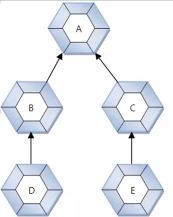
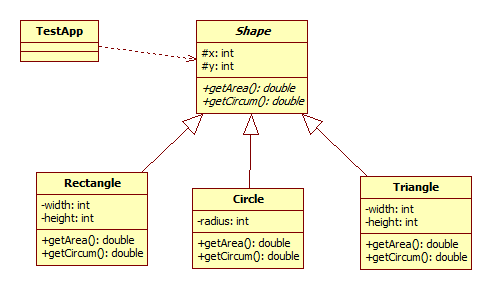

# 4/19 Java Day9


> #### 이전 수업 복습
>
> 절차지향 프로그램
>
> C, Script
>
> - 업무가 복잡하고 업무가 많은 경우, 한가지 파일안에 많은 코딩이 들어간다.
> - 수정이나 유지보수가 어렵다.
>
> OOAD(UML) -> OOP (객체지향 프로그램)
>
> Java, C++, C#(Microsoft)
>
> 1. Class, object
>    - primitive type
>    - reference type
>
> OOP의 특징
>
> 1. Encapsulation
>    - A is a B
> 2. Inheritance
> 3. Polymorphism (다형성)
> 4. Abstraction (추상화)

## Ch07 상속

### 상속 개념의 활용

- 객체의 다형성 구현 가능

  - 같은 의미이지만 실행 결과가 다양한 객체 대입(이용) 가능한 성질

  - ```java
    public double insentive() {
    		double insen = 1000.0;
    		return insen;
    	} //인센 매니저 Class
    @Override
    	public double insentive() {
    		double insen = 1000.0;
    		double per = 0.0;
    		per = (result/goal*100);
    		if (per>=80) {
    			return insen*0.8;
    		}else if (per>=70) {
    			return insen*0.7;
    		}else {
    			return insen*0.5;
    			}
    	}// 인센 영업부 Class
    ```

- 상속 대상 제한
  - 부모 클래스의 private 접근 갖는 필드와 메소드 제외

### extends 키워드

- 자바는 단일 상속 - 부모 클래스 나열 불가
  - class 자식클래스 extends 부모클래스 1, ~~부모클래스 2~~

- 기본적으로 자바는 Object를 상속하고 있다.

### 부모 생성자 호출(super())

### 메소드의 재정의 (Override)

- 부모 클래스의 상속 메소드 수정해 자식 클래스에서 재정의 하는 것
- 접근 제한을 더 강하게 오버라이딩 불가
  - public을 default나 private으로 수정불가

- 부모 메소드 사용(super)

### final 클래스와 final 메소드

- final 키워드의 용도
  - final 필드 : 수정 불가 필드
  - final 클래스 : 부모로 사용 불가한 클래스
  - ★final 메소드 : 자식이 재정의할 수 없는 메소드★

- 오버라이딩 불가능

### protected 접근 제한자

### 타입변환과 다형성(polymorphism)

- 자동 타입 변환(Promotion)

  - 프로그램 실행 도중에 자동 타입이 변환이 일어나는 것

  - 바로 위의 부모가 아니더라도 상속 계층의 상위면 자동 타입 변환 가능

  - 

  - ``` 
    A a = new A();
    A a = new B();
    A a = new C();
    A a = new D();
    B b = new D();
    
    B b = new C();X
    
    public void method(A a){
    
    }
    ```

- 예 ) 그림판에 도형들이있다.
  - 각 도형들은 x,y 좌표가 있다. 
  - 사각형과 삼각형은 높이와 너비가 있고, 원은 반지름이 있다.
  - 면적과 둘레를 구해라 
- 

- shape 클래스는 추상(abstract) 클래스가 된다. (대다수의 상위 클래스는 추상 클래스가 된다.)
- 상위 클래스에서 abstract버튼 체크

```java
package graphic2;

public abstract class Shape {
	protected int x;
	protected int y;
	public Shape() {
	}
	public Shape(int x, int y) {
		this.x = x;
		this.y = y;
	}
	public int getX() {
		return x;
	}
	public void setX(int x) {
		this.x = x;
	}
	public int getY() {
		return y;
	}
	public void setY(int y) {
		this.y = y;
	}
	@Override
	public String toString() {
		return "Shape [x=" + x + ", y=" + y + "]";
	}
	
	// Abstract method 추상적 메소드
	public abstract double getArea();  
	public abstract double getCircum();
	public abstract void setColor(String color);
	
}
ract method 추상적 메소드
	public abstract double getArea();  
	public abstract double getCircum();
	
}

```

- 예. 주제: 자동차
  - 전기차, Pluged in 하이브리드100,100, 휘발유 200