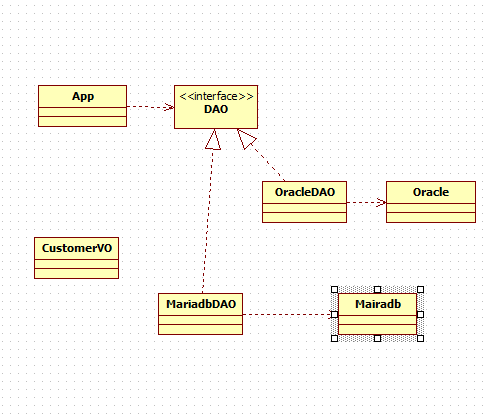

# 4/20 Java Day10

## Ch07 상속

### 추상 클래스(Abstract Class)

- 추상 
  - 실체들 간에 공통되는 특성을 추출한 것
    - 예1: 새, 곤충, 물고기 _> 동물(추상)

- 추상 클래스
  - 실체 클래스들의 공통되는 필드의 메소드 정의한 클래스
  - 추상 클래스는 실체 클래스의 부모역할
- 추상 클래스의 용도
  - 실체 클래스의 공통된 필드와 메소드의 이름 통일할 목적
    - 실체 클래스마다 필드와 메소드가 제각기 다른 이름을 가질 수 있음
  - 실체 클래스를 작성할 때 시간 절약
    - 실체 클래스는 추가적인 필드와 메소드만 선언

- 추상 메소드와 오버라이딩(재정의)
  - 예: 동물은 소리를 낸다. 하지만 실체 도움들의 소리는 제각기 다르다.
  - 구현 방법
    - 추상 클래스에는 메소드의 선언부만 작성 (추상 메소드)

## Ch08 인터페이스

### ArrayList

- 배열을 배치한다.

- 데이터가 입력하면 자동으로 늘어나고 제거하면 자동으로 줄어든다.

- ```java
  package p344;
  
  import java.util.ArrayList;
  
  public class Test {
  
  	public static void main(String[] args) {
  		// Collection API
  		
  		//CustomerVO cs[] = new CustomerVO[5];
  		
  		ArrayList<CustomerVO> list = new ArrayList<CustomerVO>();
  		list.add(new CustomerVO("id01", "pwd01", "james1"));
  		list.add(new CustomerVO("id02", "pwd02", "james2"));
  		list.add(new CustomerVO("id03", "pwd03", "james3"));
  		
  		for (CustomerVO c : list) {
  			System.out.println(c);
  		}
  	}
  
  }
  
  ```

- 

### 인터페이스의 역할

- 인터페이스란
  - 개발 코드와 객체가 서로 연동하는 접점

- 인터페이스의 역할
  - 다형성
  - 개발코드가 객체에 종속되지 않게 -> 객체 교체할 수 있도록 하는 역할

### 인터페이스 선언

- 인터페이스 선언
  - `[public] interface 인터페이스명 {...}`

- ```java
  interface 
  ```

- 상수 필드 선언

- 추상 메소드 선언

- 디폴트 메소드 선언

- 정적 메소드

### 인터페이스 구현

- 실제 클래스에서 implements를 받아서 사용한다.
- 다중 인터페이스 구현

> Map : key값과 value가 한꺼번에 저장
>
> ``` java
> / Map - key, value		
> 		HashMap<String, CustomerVO> map = new HashMap<String, CustomerVO>();
> 		
> 		// insert
> 		CustomerVO c1 = new CustomerVO("id01", "pwd01", "james1");
> 		CustomerVO c2 = new CustomerVO("id02", "pwd02", "james2");
> 		CustomerVO c3 = new CustomerVO("id03", "pwd03", "james3");
> 		CustomerVO c4 = new CustomerVO("id04", "pwd04", "james4");
> 		CustomerVO c5 = new CustomerVO("id05", "pwd05", "james5");
> 		
> 		map.put("id01", c1);
> 		map.put("id02", c2);
> 		map.put("id03", c3);
> 		map.put("id04", c4);
> 		map.put("id05", c5);	
> 		
> ```
>
> 

