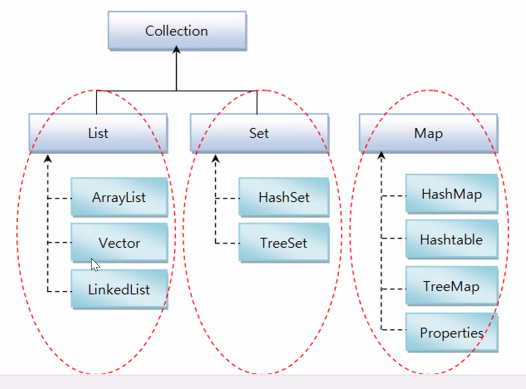

# 4/22 Java Day12

## Ch11 기본 API 클래스

### 자바 API란?

- 자바에서 기본적으로 제공하는 라이브러리(library)
- 프로그램 개발에 자주 사용되는 클래스 및 인터페이스 모음

### 자바 API 도큐먼트

- [Home: Java Platform, Standard Edition (Java SE) 8 Release 8 (oracle.com)](https://docs.oracle.com/javase/8/)

### java.lang과 java.util 패키지

- java.lang 패키지

### Object 클래스

- 객체 비교(equals())
- 객체 문자정보(tostring())
- 객체 복제(clong())

### String  클래스

-  String 메소드

  - 문자열의 추출, 비교, 찾기, 분리, 변환등과 같은 다양한 메소드 가짐

  - ```java
    String str = "abcdef";
    		
    		char c = str.charAt(3); // 3번째 값이 나온다.
    		System.out.println(c); // d가 나온다.
    		
    		int i = str.indexOf('c'); // c의 위치를 찾는다
    		System.out.println(i); // 2가 나온다.
    
    		String str2 = str.substring(1, 3); // 1값부터 3까지
    		System.out.println(str2); // bc가 나온다.
    
    		String str3 = str.trim(); //공백제거
    
            char cs[] = str.toCharArray();// 배열안에 스트링값 char로 저장
    		for (char d : cs) {
    			System.out.println(d);
    		}
            
            String ss = "1,2,3,4,5";
    		String result [] = ss.split(","); //()기준으로 나눈다.
    		
    		for (String st : result) {
    			System.out.println(st);
    		}
    ```

### StringBuffer

- 변환된 값이 저장되는 String

- ```java
  package p496;
  
  public class StringBufferTest {
  
  	public static void main(String[] args) {
  		StringBuffer sb = new StringBuffer("abcdef");
  		sb.append("ghi");
  		System.out.println(sb);
  		sb.reverse();
  		System.out.println(sb);
  		sb.delete(2, 3);
  		System.out.println(sb);
  	}
  
  }
  ```

### Wrapper(포장) 클래스

- ```java
  package p496;
  
  public class WrapperTest {
  	
  	public static void main(String[] args) {
  		int a = 10;
  		Integer i = 10;
  		
  		int result = a + i;
  		System.out.println(result);
  		
  		if(a == i) {
  			System.out.println("ok");
  		}
  	}
  
  }
  ```

### Math, Random  클래스

#### ~  Random 클래스

```java
package p496;

import java.util.Random;

public class RandomTest {

	public static void main(String[] args) {
		double d = Math.random(); // 0.0 <= x < 1.0
		System.out.println(d);
		
		int i1 = (int)(Math.random() * 6) + 1;
		System.out.println(i1);
		
		int i2 = (int)(Math.random() * 45) + 1;
		System.out.println(i2);
		
		Random r = new Random();
		int i3 = r.nextInt(45)+1;
		System.out.println(i3);
		
		double dd = (r.nextDouble() * 100000000000.0)+1;
		System.out.println(dd);
		System.out.printf("%.0f",dd);
	}

}
```

#### Date, Calendar 클래스

- ```java
  package p496;
  
  import java.text.SimpleDateFormat;
  import java.util.Calendar;
  import java.util.Date;
  import java.util.TimeZone;
  
  public class DateTest {
  
  	public static void main(String[] args) {
  		Date date = new Date();
  		System.out.println(date); //Fri Apr 22 11:34:58 KST 2022
  		SimpleDateFormat sdf =
  				new SimpleDateFormat("YYYYMMdd-hhmmss");
  		
  		String str = sdf.format(date);
  		System.out.println(str); //기본:22. 4. 22. 오전 11:37 
  		                          //"YYYYMMdd-hhmmss": 20220422-113833
  		
  		TimeZone tz = TimeZone.getTimeZone("America/Los_Angeles");
  		
  		SimpleDateFormat sdf2 =
  				new SimpleDateFormat("YYYY:MM:dd-hh:mm:ss");
  		sdf2.setTimeZone(tz);
  		System.out.println("tz"+sdf2.format(new Date()));
  		
  		
  		Calendar cal = Calendar.getInstance(tz);
  		int yy = cal.get(Calendar.YEAR);
  		int mm = cal.get(Calendar.MONTH)+1;
  		int dd = cal.get(Calendar.DAY_OF_MONTH);
  		int hh = cal.get(Calendar.HOUR);
  		int mi = cal.get(Calendar.MINUTE);
  		int ss = cal.get(Calendar.SECOND);
  		System.out.printf("%d %d %d %d %d %d ",yy,mm,dd,hh,mi,ss);
  	}
  
  }
  ```

### Format 클래스

- DecimalFormat : 숫자를 원하는 형식으로 출력

  - ```java
    package p496;
    
    import java.text.DecimalFormat;
    
    public class FormatTest {
    
    	public static void main(String[] args) {
    		double num = 123456.789;
    		DecimalFormat df = new DecimalFormat("#,###");
    		
    		String str = df.format(num);
    		System.out.println(str);
    	}
    
    }
    ```

- SimpleDateFormat : 날짜 형식 클래스

  - ```java
    SimpleDateFormat sdf = new SimpleDateFormat("yyyy-MM-dd, hh:mm:S E a");
    		String str2 = sdf.format(new Date());
    		System.out.println(str2);
    ```

## Ch15 컬렉션 프레임워크 소개

- 
- Collection 이 최상위 클래스
- List, Set, Map 모두 추상클래스
- ★ List (데이터 중복 O) ★
  - 순서를 유지하고 저장
  - ArrayList : 여러개의 데이터를 넣는다. 데이터를 LinkedList 보다 조금 사용하지만 데이터가 많을 때에는 LinkedList가 빠르다.
  - 초기용량은 자동적으로 10개를 저장할 수 있는 용량
- Set : 여러개의 데이터를 넣는다 (데이터 중복X)
  - 순서를 유지하지 않고 저장

- Map : Key, Value로 저장
  - Properties

### LIFO (후입선출) 와 FIFO (선입선출) 컬렉션

- LIFO (Lst In First Out) 스택(Stack) 클래스

  - ```java
    package p722;
    
    import java.util.Stack;
    
    public class StackTest {
    
    	public static void main(String[] args) {
    		Stack<String> st = new Stack<String>();
    		st.push("a"); // push는 넣기
    		st.push("b");
    		st.push("c");
    		st.push("d");
    		
    		while(!st.isEmpty()) {
    			String s = st.pop(); //pop은 빼기
    			System.out.println(s);
    		}
    	}
    
    }
    ```

    

- FIFO (First in First Out) 큐 클래스

## Ch13 제네릭

> `ctrl + shift + o` : import를 정리해주는 단축키 