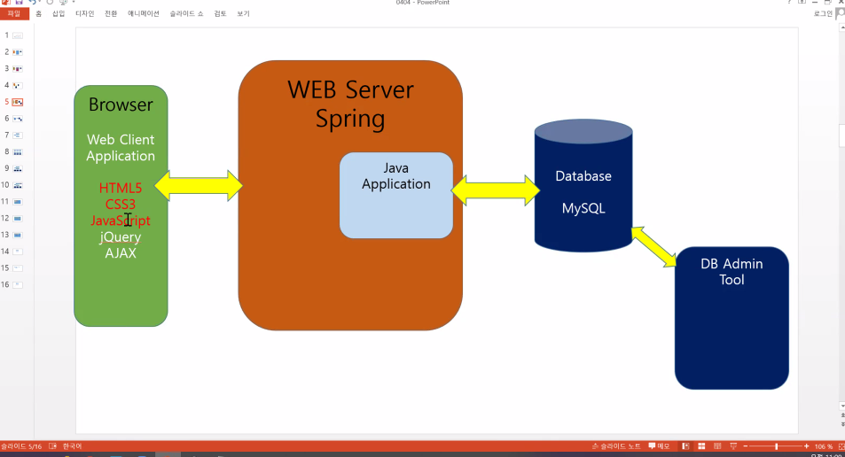
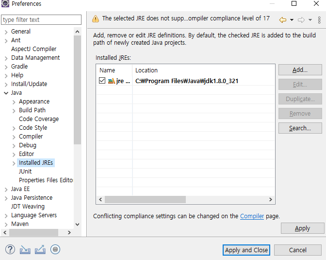
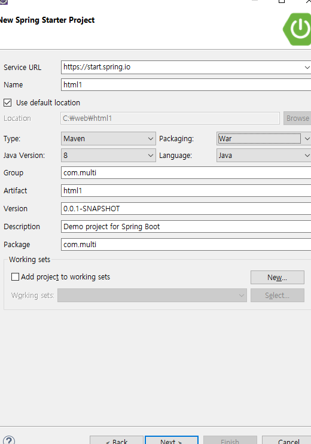
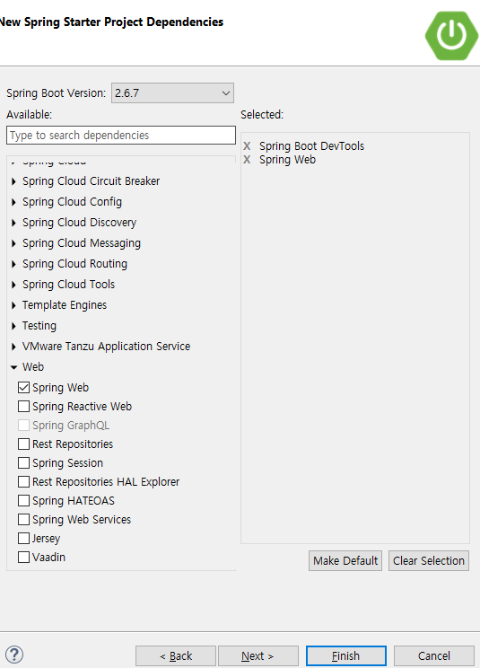

# 4/4 Java Day1

> 자바 STS 환경 설정
>
> 1. eclipse 실행
>
> 2. Help > Eclipse Marketplace 선택
>
> 3. STS 검색
>
> 4. Spring Tools 3와 Spring Tools 3 Add-On 설치
>
> 5. eclipse 재실행

## Ch.01 웹 개요와 실습 환경 구축

[W3C 공부](www.w3schools.com)

### 인터넷과 웹 시작

- 인터넷 익스플로러 -> 크롬 (승리) /2019년 기준



<자바 재설정>



<프로젝트 설정>

\1. project 생성

\2. Spring Boot > Spring Starter Project 선택

\3. 프로젝트명 입력

\4. Group과 Package 명 선택, 반드시 두개 이상의 package 명으로 입력

\5. Dependencies 선택

​	1) Spring Boot DevTools

​	2) Spring Web

\6. pom.xml 추가

\7. Directory 생성

src > main > webapp > WEB-INF > views


\8. Proejct Properties > Java Build Path > Source에서 Add Folder

WEB-INF > views 선택 추가


\9. src/main/resources 에 applications.properties 파일 수정 (반드시 메모장으로 열것)

server.port=80 spring.mvc.view.prefix=/WEB-INF/views/ spring.mvc.view.suffix=.jsp

\10. 80 port 문제 시 

제어판 > 시스템 및 보안 > 관리도구 > 서비스 > World Wide Web Publishibg  서비스 

중시 및 수동으로 전환





디펜던시 다음에 추가

```java
        <!-- @Inject -->
		<dependency>
			<groupId>javax.inject</groupId>
			<artifactId>javax.inject</artifactId>
			<version>1</version>
		</dependency>
		<!-- Servlet -->

		<dependency>
			<groupId>org.apache.tomcat.embed</groupId>
			<artifactId>tomcat-embed-jasper</artifactId>
			<scope>provided</scope>
		</dependency>


		<dependency>
			<groupId>javax.servlet</groupId>
			<artifactId>javax.servlet-api</artifactId>
			<version>3.0.1</version>
			<scope>provided</scope>
		</dependency>
		<dependency>
			<groupId>javax.servlet</groupId>
			<artifactId>jstl</artifactId>
			<version>1.2</version>
		</dependency>
		
		<!-- json request -->   

		<dependency>
			<groupId>com.googlecode.json-simple</groupId>
			<artifactId>json-simple</artifactId>
			<version>1.1</version>
  		</dependency>
```

#### 웹구성

- src/main/resources -> static 은 이미지를 나타낸다 

#### 웹 표준

- HTML5 : 웹페이지 구성

  - 주요기능
    - 통신 : 서버와 실시간으로 쌍방향 통신을 수행
    - 장치 접근 : 장치에 접근해 장치 정보를 가져오거나 장치 기능을 사용 할 수 있습니다.

- CSS3 : 스타일 적용

  - Cascading Syle Sheets

  - ```java
    h1{
    		color:red;
    		background:black;   // CSS
    	}
    ```

- 자바스크립트 : 사용자 반응 처리 등등

  - <script> 
        function go(){        alert('Clicked')            };
    </script>

> opengl 수족관

## Ch. 02 웹페이지 기본 구조와 작성 방법

### 1. HTML5 기본 용어

#### 태그와 요소

- 태그

  - ```html
    <h1>Header1</h1>
    	<h2>Header2</h2>
    	
    ```

### 2. HTML5 페이지 구조와 작성법

#### 스타일시트 작성과 실행

- src/main/resources/static 안에 css 폴더 생성후 css 파일 생성

- 외부 스타일 시트 작성과 실행

  - ```html
    <link rel="stylesheet" href="css/p52.css">
    ```

  - p52.css

  - ```css
    @charset "EUC-KR";
    	h1{
    		color:red;
    	}
    	h2{
    		color:blue;
    	}
    ```

#### 자바스크립트 작성과 실행

- 외부 자바 스크립트 작성과 실행

  - src/main/resources/static 안에 js 폴더 생성후 javascript 파일 생성

  - ```javascript
    <script src="js/p52.js"></script>
    ```

  - p52.js

  - ```javascript
    /**
     *  2020.05.10
     */
     
    function go(){
    			alert('Clicked')
    };
    ```

#### view-source:https

- 주소의 소스를 볼 수 있다.