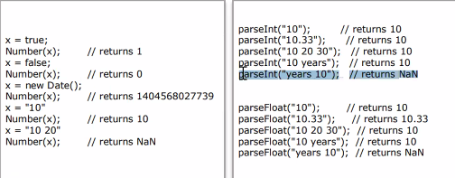
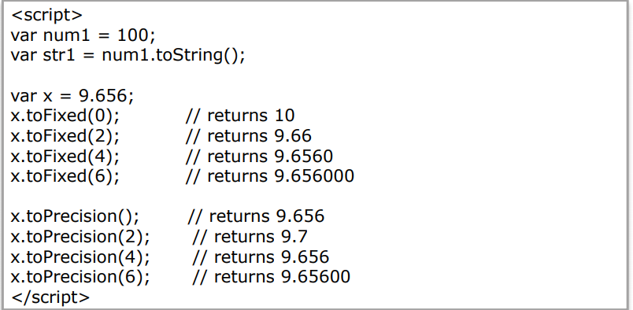
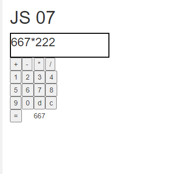

# 5/16 JavaWeb Day5

## HTML5

### 1. HTML5의 필요성

- 오랫동안 유지되었던  HTML4.1의 한계 극복 필요
- 다양한 플랫폼 및디바이스 대응 필요

### 2. HTML5의 신규 기능

- 웹 스토리지(Web Storage)
  - 브라우저 화면에 있는 내용을 브라우저에 저장을하여 임시 저장을 할 수 있다.
  - 인터넷 접속이 끊긴 상태에서도 이미 살펴보았던 게시판이나 웹 메일을 볼 수 있도록 애플리케이션을 만들 수 있다.

- 드래그 앤 드롭(Drag & Drop)
  - 웹 페이지상에서 원하는 항목을 드래그 할 수 있게 해주는 API

- 지오로케이션(Geolocation)
  - 여러 포털 사이트에서 제공하는 공개지도 API와 함께 사용하면 자신의 현재 위치를 알아 낼 수 있는 애플리케이션을 수비게 만들 수 있다.

- 캔버스(Canvas) 2D
  - 웹에서 직접 그림을 그리는 애플리케이션을 만들 수 있다.
  - 3D기능은 OPEN GL을 웹에 맞게 변경한 Web GL을 사용한다.
- 웹 워커(Web Workes)
  - 스레드를 나눌 수 있다.
- 인젝스드 DB(Indexed DB)
  - 웹 스토리지의 내용과 비슷
- 웹 소켓(Web Socket)
  - 실시간 양방향 통신을 위한 기능을 제공
  - ex) Daum의 증권 

### 3.HTML5 구성

- HTML5 TAG
- UI Design
  - CSS3.0
- Program
  - JavaScrpt
  - JQuery
  - Ajax

## JavaScript

### 1. What is JavaScript

- 1996년 2월에 Netscape사가 만들었다.
- ECMA(Europe Computer Manufacture Association)
- jQuery와 같은 크로스 브라우징이 가능한 Libaray로 파생

### 2. JavaScript의 필요성

- CSS를 자유롭게 변경 한다.
- Web Page에서의 프로그램 부분을 담당한다.

### 3. JavaScript의 구조

```javascript
function h2(){
	alert('Alert ..........') //페이지 전환 또는 동작시 먼저 상단에 알림처럼 뜬다.
	var h2 = document.querySelector('#hh2'); // var는 변수를 나타낸다.
	h2.innerHTML = 'replace text';
};
window.onload = function(){ // 페이지가 출력이 되면 자동으로 동작되는 함수
	var h3 = document.querySelector('#hh3');
	var i = 10;
	var j = 20;
	var result = i * j;
	h3.innerHTML = result;	
```

### 4. Daye Type

- 변수 선언, 함수 선언, Object 생성시 명명 규칙
  - 스페이스는 포함 할 수 없다.
  - 문자는 대소문자를 구분한다.
- 정수, 실수 나누지 않고 숫자다.
- undefined : 어떠한 데이터 타입도 선언되지 않은 상태
- number: 실수, 정수 모두 포함
- boolean: true, false 를 의미 함
- string : 문자열, character 모두 퐇마 "",''로 표현.
- array : 배열, 다양한 타입을 포함 할 수 있다. 데이터 타입은 object로 표현. []로 사용
- object: 객체 type 을 의미 {}로 사용
- function : 함수를 의미, JavaScript에서는 함수를 하나의 타입으로 선언 하여 사용 할 수 있다.

```javascript
<meta charset="UTF-8">
<script>
window.onload = function(){
	var h2 = document.querySelector('#hh2');
	//숫자
	var num = 100; 
	//boolean
	var b = true; 
	// string
	var str ='100'; 
	//undefined
	var v; 
	//array
	var a = [1,2,3,4,5]; 
	 //object
	 // JSON(JavaScript Object Notation)
	var obj = {id:'id01',name:'lee',age:10};
	// function
	var f = function(){
		return 333;
	};
	var type = typeof(f);
	//h2.innerHTML = type + ' ' + (Number(str)+num);
	h2.innerHTML = type + ' ' + f();
};

</script>
<h1>JS 02</h1>
<h2 id = "hh2"></h2>
```

#### JavaScript Number

- Number(): number 타입이 아닌 변수를 number로 변경
- parseInt(): 정수 형으로 변경
- parseFloat(): 실수 형으로 변경
- 

- toStirng(): number를 string으로 변경
- toFixed(): 특정 수까지 반올림 하여 문자로 변환
- torPrecision(): 특정 수에서 반올림 하여 문자로 변환

#### Java Math

```javascript
var num1 = Math.min(0, 150, 30, 20, -8, -200);// returns -200
	var num2 = Math.max(0, 150, 30, 20, -8, -200);// returns 150
	var num3 = Math.random();// returns a random number
	var num4 = Math.round(4.7); // returns 5 반올림
	var num5 = Math.round(4.4); // returns 4
	var num6 = Math.ceil(4.4);// returns 5 올림
	var num7 = Math.floor(4.7);// returns 4 내림
	var num8 = Math.floor(Math.random() * 11);// returns a random number between 0 and 10
```

#### 계산기 만들기 실습

```html
<meta charset="UTF-8">
<style>
	#how {
		width: 200px;
		height: 50px;
		border: 2px solid black;
		font-size: x-large;
	};
</style>
<script>
	function plus(){
		var p = '+';
		document.querySelector('#how').innerHTML += p;
	};
	function minus(){
		var m = '-';
		document.querySelector('#how').innerHTML += m;
	};
	function multi(){
		var m = '*';
		document.querySelector('#how').innerHTML += m;
	};
	function divi(){
		var d = '/';
		document.querySelector('#how').innerHTML += d;
	};
	function one(){
		var p = '1';
		document.querySelector('#how').innerHTML += p;
	};
	function two(){
		var p = '2';
		document.querySelector('#how').innerHTML += p;
	};
	function three(){
		var p = '3';
		document.querySelector('#how').innerHTML += p;
	};
	function four(){
		var p = '4';
		document.querySelector('#how').innerHTML += p;
	};
	function five(){
		var p = '5';
		document.querySelector('#how').innerHTML += p;
	};
	function six(){
		var p = '6';
		document.querySelector('#how').innerHTML += p;
	};
	function seven(){
		var p = '7';
		document.querySelector('#how').innerHTML += p;
	};
	function eight(){
		var p = '8';
		document.querySelector('#how').innerHTML += p;
	};
	function nine(){
		var p = '9';
		document.querySelector('#how').innerHTML += p;
	};
	function zero(){
		var p = '0';
		document.querySelector('#how').innerHTML += p;
	};
	function c(){
		document.querySelector('#how').innerHTML = '';
	};

	function dele(){
		var p = '3';
		document.querySelector('#how').innerHTML += p;
	};
	function res(){
		var txt = document.querySelector('#how').innerHTML;
		var result = eval(txt);
		
		document.querySelector('#fi').innerHTML = result;
		document.querySelector('#how').innerHTML = '';
	};
</script>
<h1>JS 07</h1>

<div id="how"></div>
<table>
<tbody>
<tr><td><button onclick = "plus();">+</button></td><td><button onclick = "minus();">-</button></td><td><button onclick = "multi();">*</button></td><td><button onclick = "divi();">/</button></td></tr>
<tr><td><button onclick = "one();">1</button></td><td><button onclick = "two();">2</button></td><td><button onclick = "three();">3</button></td><td><button onclick = "four();">4</button></td></tr>
<tr><td><button onclick = "five();">5</button></td><td><button onclick = "six();">6</button></td><td><button onclick = "seven();">7</button></td><td><button onclick = "eight();">8</button></td></tr>
<tr><td><button onclick = "nine();">9</button></td><td><button onclick = "zero();">0</button></td><td><button onclick = "dele();">d</button></td><td><button onclick = "c();">c</button></td></tr>
<tr><td colspan ="2"><button onclick = "res();">=</button></td><td colspan ="2" id = "fi"></td></tr>
</tbody>
</table>
```


