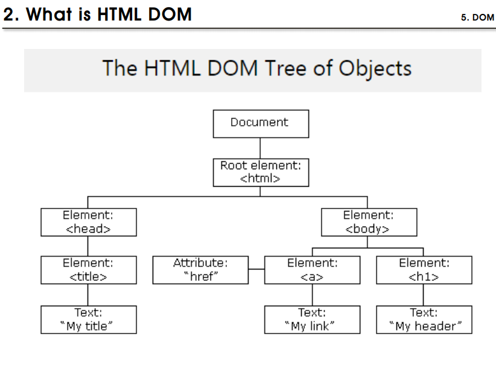
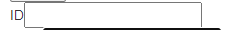
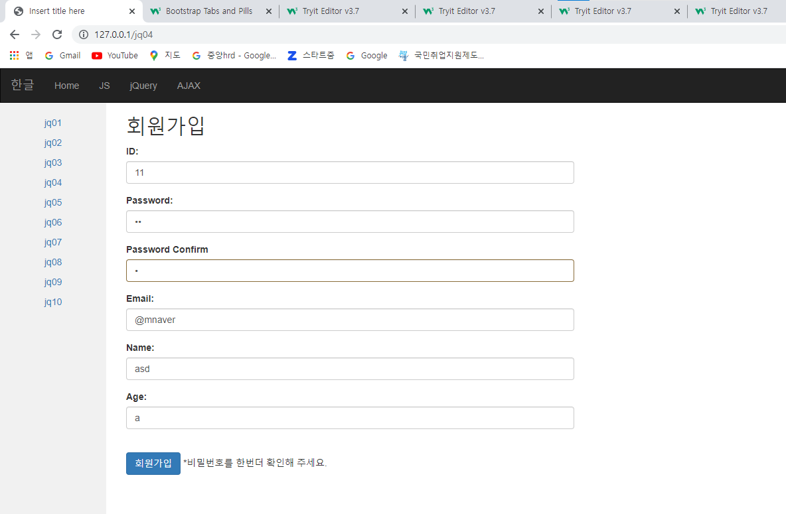

# 5/17 JavaWeb Day6

> 새로운 언어를 학습할때 순서
>
> 1. What is '새로운 언어'
> 2. 구조와 구문 
> 3. 데이터 타입과 함수
> 4. 조건과 반복문

## JAVASCRIPT

### 1. Array (배열)

- 배열의 사용법

```html
<meta charset="UTF-8">
<style>
	#result{
		width: 300px;
		border: 2px solid red;
	}
</style>
<script>
	function display(d){
		var txt = '';
		for(var i in d){
			txt += '<h2>';
			txt += d[i].id+ ' ' + d[i].name + ' ' + d[i].age;
			txt += '</h2>';
		};
		document.querySelector('#result').innerHTML = txt;
	}

	function getdata(){
		var a = [
			{id:'id01',name:'lee',age:10},
			{id:'id02',name:'hong',age:20},
			{id:'id03',name:'lim',age:30},
			{id:'id04',name:'kang',age:40},
			{id:'id05',name:'ho',age:50}
		];
		display(a);
	};
</script>
<h1>JS 09</h1>
<button onclick="getdata();">GET DATA</button>
<div id="result"></div>
```

- break
  - 반복문에 한해서 멈춘다.
- continue
  - 반복문 특정 조건일 경우 해당 블록을 skip한다.

- return
  - 함수를 종료시키는 제어 함수

### 2. DOM

### i) What is DOM

- DOM(Document Object Model)은 W3C에서 제정한 문서 표준이다.

#### ii) What is HTML DOM

- 웹브라우져를 위한 문서 표준 HTML을 위한 프로그램 인터페이스
  - tag
    - 
  - attribute

- javascript를 통해 html dom을 접근하고 위의 모든 작업을 진행한다.



#### iii) HTML Element에 이벤트를 처리하는 방법

```html
<meta charset="UTF-8">
<script>
window.onload = function(){
	var c1 = document.querySelector('#c1');
	var c2 = document.querySelector('#c2');
	var c3 = document.querySelector('#c3');
	var h1 = document.querySelector('h1');
	
	c1.onclick = (function(){
		//alert('c1');
		h1.innerHTML = 'Clicked C1';
	});
	c2.onclick = (function(){
		var c = confirm('회원가입 하시겠습니까?')
		if(c == true){
			location.href='/';
		}
	});
	c3.onclick = (function(){
		//alert('c3');
		var c = confirm('네이버로 가시겠습니까?'); //conform : 트루 펄스값을 구해 한번더 확인
		if(c == true){
			location.href='http://www.naver.com'; //★ 자바스크립트에서 특정한 url이동하는 것 ★
		}
	});
	h1.onclick = (function(){
		var c = prompt('숫자를 입력 하세요?',0);
		this.innerHTML = c; //this는 해당하는 오브젝트를 불러낸다.
	});
};
</script>
<h1>JS 10</h1>
<button id="c1">Click1</button>
<button id="c2">Click2</button>
<h2><a id="c3" href="#">Click</a></h2>

```


### 3. BOM

- BOM(Browser Object Model)은 JavaScript를 통해 Brower에서 제공하는 기능을 제어하는 방법을 제공

- 다음과 같은 정보를 사용 할 수 있다.

  - window

  - screen

  - location

    - location.href : ★ 자바스크립트에서 특정한 url이동하는 것 ★

  - Popup

    - alert
    - conform : 트루 펄스값을 구해 한번더 확인

  - timing

    > Idea! timing과 table, 그리고 href를 통해 두더지 잡기를 웹에 구현 한다.

    - setInterval : 반복적인 이벤트 타이밍을 제공 한다.

    - setTimeout : 이벤트 타이밍을 제공한다

    - ClearInterval

    - ```html
      <meta charset="UTF-8">
      <script>
      window.onload = function(){
      	var hh1 = document.querySelector('#hh1');
      	var s1 = setInterval(function(){
      		var txt = hh1.innerHTML;
      		txt += "*";
      		hh1.innerHTML = txt;
      	}, 500);
      	setTimeout(function(){
      		clearInterval(s1);
      		location.href='http://www.naver.com';
      	} , 5000);
      };
      </script>
      
      <h1> JS 11</h1>
      
      <h1 id = "hh1"></h1>
      ```

## jQuery

> Javascript와 혼용되어 프로그래밍에 사용된다.

### 1. What is jQuery

- 2006년 1월, John Resig이 BarVamp BYC에서 발표
- 자바스크립트 라이브러리 중 하나(일부)
- 프로그래밍을 아주 쉽고 빠르게 작업이 가능

### 2. jQuery 특징

- 이벤트 처리가 쉽다.

### 3. jQuery 설치

```html
<script src="https://ajax.googleapis.com/ajax/libs/jquery/3.6.0/jquery.min.js"></script>
```

### 4. jQuery 구조

```html
<meta charset="UTF-8">
<script>
$(document).ready(function(){
	$('h1').css('color','red');
	$('#hh1').html('<a href="#">Click</a>');
	var txt = $('h1').eq(0).text(); // 0번째를 선택
	$('h1').eq(1).text(txt); // txt의 데이터를 가져올때도 text함수, 불러낼때도 text함수를 사용한다.
	$('h1 > a').click(function(){
		location.href = "/jq";
	});
});
</script>

<h1>JQ 01</h1>
<h1>Header1</h1>
<h1 id="hh1">Header2</h1>
```

### 5. Systax (구문)

- $(selector).action()

``` html 
window.onload = function(){ // javascript

};
=

$(document).ready(function(){ //jQuery

});
```

### 6 .함수

#### i) jQuery Events

- .focus();

  - 태그에 클릭이 되어질때 사용 

    

    

- .blur();

  - 태그에 포커스가 지워질때 되어질때 사용

    

- .hover();
  - 마우스가 올려질때 반응 
  - 2개의 함수가 필요하다. (올려졌을때, 꺼졌을때)

```html
<meta charset="UTF-8">
<style>
.b{
	color:white;
	background:gray;
}
</style>
<script>
$(document).ready(function(){
	
	$('button').on({
		'click':function(){
			$(this).css({'color':'yellow','background':'black'});
		},
		'mouseenter':function(){
			$('h1').text('mouse enter');
			$(this).addClass('b');
		},
		'mouseleave':function(){
			$('h1').text('mouse leave');
			$(this).removeClass('b');
		}
	});
	/*
	$('button').mouseenter(function(){
		$('h1').text('mouse enter');
	});
	$('button').mouseleave(function(){
		$('h1').text('mouse leave');
	});
	$('button').click(function(){
		$(this).css({'color':'yellow','background':'black'});
	});
	*/
	$('h2').hover(function(){
		$(this).addClass('b');
	},function(){
		$(this).removeClass('b');
	});
	$('input[name="id"]').focus(function(){
		$(this).addClass('b');
		$('form > span:eq(0)').text('ID를 입력 하세요');
	});
	$('input[name="id"]').blur(function(){
		$(this).removeClass('b');
		var txt = $(this).val();
		if(txt == ''){
			$(this).focus();
		};
		if(txt.length < 5){
			$('form > span:eq(0)').text('ID는 5개 이상이어야 합니다.');
		};
	});
})
</script>

<h1>JQ 02</h1>

<h2>Header2</h2>
<button>Button</button>
<form>
ID<input type="text" name="id"><span></span><br>
PWD<input type="password" name="pwd"><span></span><br>
<input type="submit" value="login">
</form>
```

#### 회원가입창 bootcamp활용하여 실습

```html
<meta charset="UTF-8">
<style>
	#status{
		display:inline-block;
		width: 300px;
		height: 40px;
	}
</style>
<script>
$(document).ready(function(){
	$('input[name = pwdco]').blur(function(){
		var pwd = $('input[name = pwd]').val();
		var pwdco = $('input[name = pwdco]').val();
		
		if(pwd != pwdco){	
			$('#status').text('*비밀번호를 한번더 확인해 주세요.');
		}
	});
	$('button').click(function(){
		
		var id = $('input[name = id]').val();
		var email = $('input[name = email]').val();
		var pwd = $('input[name = pwd]').val();
		var pwdco = $('input[name = pwdco]').val();
		var name = $('input[name = name]').val();
		var age = $('input[name = age]').val();
		if(id == ''){
			alert('회원정보 공백 확인 필요');
			return;
		};
		if(email == ''){
			alert('회원정보 공백 확인 필요');
			return;
		};
		if(pwd == ''){
			alert('회원정보 공백 확인 필요');
			return;
		};
		if(pwdco == ''){
			alert('회원정보 공백 확인 필요');
			return;
		};
		if(name == ''){
			alert('회원정보 공백 확인 필요');
			return;
		};
		if(age == ''){
			alert('회원정보 공백 확인 필요');
			return;
		};
		
		$('#signup_form').attr({
			'action':'signup',
			'method':'post'
		});
		$('#signup_form').submit();
	});
});

</script>
<body>

<div class="container col-sm-6">
  <h2>회원가입</h2>
  <form id = signup_form>
    <div class="form-group">
      <label for="id">ID:</label><br>
      <input type="text" class="form-control" id="id" placeholder="아이디를 입력해주세요." name="id">
    </div>
    <div class="form-group">
      <label for="pwd">Password:</label><br>
      <input type="password" class="form-control" id="pwd" placeholder="비밀번호를 입력해주세요." name="pwd">
    </div>
    <div class="form-group has-warning has-feedback">
      <label for="pwdco">Password Confirm</label>
      <div>
        <input type="password" class="form-control" name = "pwdco" placeholder="비밀번호 확인" id="pwdco">
        <span class="glyphicon glyphicon-warning form-control-feedback" id = pwdr></span>
      </div>
    </div>
    <div class="form-group">
      <label for="email">Email:</label><br>
      <input type="email" class="form-control" id="email" placeholder="이메일을 입력해주세요." name="email">
    </div>
    <div class="form-group">
      <label for="name">Name:</label><br>
      <input type="text" class="form-control" id="text" placeholder="이름을 입력해주세요." name="name">
    </div>
    <div class="form-group">
      <label for="age">Age:</label><br>
      <input type="text" class="form-control" id="age" placeholder="이메일을 입력해주세요." name="age">
    </div>
    <br>
    <button class="btn btn-primary">회원가입</button>
    <span id = status></span>
  </form>
</div>

</body>
</html>
```

