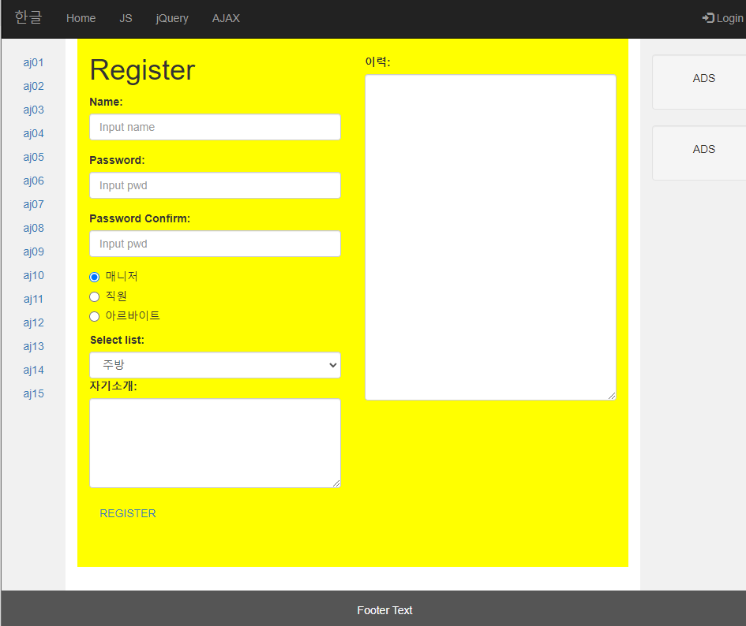

# 5/19 JavaWeb Day8

> synchronized
>
> - 동기화
> - 전체의 화면을 바꾸면서 동작
> - 지금까지 했던 html 형식 
>
> Asynchronous
>
> - 비동기화
> - 화면은 그대로 있지만 특정 영역에만 데이터를 받아와 바꾼다.
> - ex) 다음 증권

## AJAX

> Javascript안에 통신을 할 수 있게 하는 라이브러리

### 1. What is AJAX

- AJAX(Asynchronous JavsScript and XML)는 비동기 통신을 지원 하는 새로운 방식이다.

- 화면 전체를 재로드 하지 않고도 서버에서 특정 데이터를 송 수신 할 수 있다.

### 2. jQeury를 이용한 AJAX

@RestController

#### 시계를 호출 실습

- aj01.html

```html
<meta charset="UTF-8">

<script>
function display(data){
	$('h3').text(data);
	
};
function getdata(){
	$.ajax({
		
		url:'gettime',
		success:function(data){
			display(data);
		},
		error:function(e){
			alert('Error:'+e.responseText);
		}
	});
};

$(document).ready(function(){
	setInterval(function(){
		getdata();
	}, 1000);
	
});
</script>

<h1>AJ 01</h1>

<h3></h3>
```

- AJAXController.java

```java
@RestController
public class AJAXController {

	@RequestMapping("/gettime")
	public Object gettime() {
		Date d = new Date();
		return d.toString();
	}
```

#### AJAX 활용 서버 전송 검색 실습

- aj02.html

```html
<meta charset="UTF-8">
<style>
	#result{
		width:500px;
		border:2px solid red;
	}
</style>
<script>
function display(data){
	var txt = '<h2>' + data+ '</h2>';
	$('#result').html(txt);
};

function getdata(txt){
	$.ajax({
		url:'search',
		data:{'s':txt},
		success:function(data){
			display(data);
		},
	});
};

$(document).ready(function(){
	$('button').click(function(){
		var txt = $('#txt').val();
		getdata(txt);
	});
	
});
</script>
<h1>AJ 02</h1>
<input type ="text" id="txt">
<button>GETDATA</button>
<div id="result"></div>
```

#### AJAX 활용 회원가입 실습

- aj04.html

```html
<meta charset="UTF-8">
<style>
	#result{
		width:500px;
		border:2px solid red;
	}
</style>
<script>
function register(){
	var id = $('#input[name="id"]').val();
	var pwd = $('input[name="pwd"]').val();
	$('#register_form').attr({
		'action':'regiimpl',
		'method':'post'
	});
	$('#register_form').submit();
};

function checkid(id){
	$.ajax({
		url:'checkid',
		data:{'id':id},
		success:function(data){
			if(data =='1'){
				$('#iid').text('사용가능 합니다.');
			}else{
				$('#iid').text('사용 불가능 합니다.');
			}
		}
	});
};

$(document).ready(function(){
	$('button').attr('disabled','disabled');
	$('button').click(function(){
		
	});
	
	$('input[name="id"]').keyup(function(){
		var id = $(this).val();
		// 길이가 3자리 미만이면 span에 "3자리 이상이어야 합니다" 출력
		if(id.length < 3){
			$("#iid").text("3자리 이상이어야 합니다.");
		}else{
			$("#iid").text("");
			checkid(id);
		}
	});
	$('input[name="pwd2"]').keyup(function(){
		var pwd = $('input[name="pwd"]').val();
		var pwd2 = $('input[name="pwd2"]').val();
		if(pwd == pwd2){
			$("#ppwd").text("v");
			$('button').removeAttr('disabled');
		}else{
			$("#ppwd").text("비밀번호를 한번 더 확인해 주세요.");
		}
	});
	$('button').click(function(){
		var id = $('input[name="pwd2"]').val();
		var pwd = $('input[name="pwd"]').val();
		var pwd2 = $('input[name="pwd2"]').val();
		if(id == ''||pwd !=pwd2){
			alert('정보를 확인해주세요');
			return;
		}else{
			register();		
		}
	});
});
</script>
<h1>AJ 03</h1>
<form id="register_form">
ID<input type="text" name="id"><span id="iid"></span><br>
PWD<input type="password" name="pwd"><br>
PWD2<input type="password" name="pwd2"><span id = "ppwd"></span><br>
<button>REGISTER</button>
</form>
```

##### AJAX를 활용한 회원가입

- aj04.html

```html
<meta charset="UTF-8">
<style>
	#result{
		width: 100px;
		height: 30px;
		background-color: gray;
		color: white;
	}
	.container{
		background: yellow;
		height: 670px;
	}
</style>
<script>
function checkname(name){
	$.ajax({
		'url':'checkname',
		data:{'name':name},
		success:function(data){
			if(data== '1'){
				$('#result').text('사용 가능한 이름입니다.');
			}else{
				$('#result').text('5자 이상은 불가능 합니다.');
			}
		}
	});
};
function register(){
	var name = $('#name').val();
	var pwd = $('#pwd').val();
	var opt = $('input[name="optradio"]').val();
	var sel = $('#sel').val();
	
	$('#register_form').attr({
		'action':'regis',
		'method':'post'
	});
	$('#register_form').submit();
};
$(document).ready(function(){
	var name = $('#name').val();
	var pwd = $('#pwd').val();
	var pwdco = $('#pwdco').val();
	var opt = $('input[name="optradio"]').val();
	var sel = $('#sel').val();
	$('.help-block').hide();
	$('#name').blur(function(){	
		var name = $('#name').val();
		if(name == ''){
			$('#name_help').fadeIn(400);
			$(this).focus();
		}else{
			$('#name_help').fadeOut(400);
			checkname(name);
		}
	});
	$('#pwd').blur(function(){	
	var pwd = $('#pwd').val();
	if(pwd == ''){
		$('#pwd_help').fadeIn(400);
		$(this).focus();
	}else{
		$('#pwd_help').fadeOut(400);
		checkname(name);
	}
	});
	$('#pwdco').keyup(function(){
		var pwd = $('#pwd').val();
		var pwdco = $('#pwdco').val();
		
		if(pwd == pwdco){
			$('#pwdco_help').fadeIn(400);
			$('#pwdco_help').text('비밀번호가 맞아요.');
		}else{
			$('#pwdco_help').fadeIn(400);
			$('#pwdco_help').text('비밀번호를 다시확인하세요');
		}
	});
	$('#register_bt').click(function(){
		register();
	});
});
</script>

<div class ="container col-sm-6">
	<h1>Register</h1>	
	<form id="register_form">
	<div class="form-group">
      <label for="name">Name:</label>
      <input type="text" name= "name" class="form-control" id="name" placeholder="Input name">
   	  <span id="name_help" class="help-block">This is Mandatory Field...</span>
    </div>
    <div class="form-group">
      <label for="pwd">Password:</label>
      <input type="password" name="pwd" class="form-control" id="pwd" placeholder="Input pwd">
      <span id="pwd_help" class="help-block">This is Mandatory Field...</span>
    </div>
    <div class="form-group">
      <label for="pwdco">Password Confirm:</label>
      <input type="password" name="pwdco" class="form-control" id="pwdco" placeholder="Input pwd">
      <span id="pwdco_help" class="help-block"></span>
    </div>
	<div class="radio">
	  <label><input type="radio" name="optradio" value="매니저" checked>매니저</label>
	</div>
	<div class="radio">
	  <label><input type="radio" name="optradio" value="직원">직원</label>
	</div>
	<div class="radio">
	  <label><input type="radio" name="optradio" value="아르바이트">아르바이트</label>
	</div>
	<div class="form-group">
	  <label for="sel1">Select list:</label>
	  <select class="form-control" id="sel" name="sel">
	    <option value="주방">주방</option>
	    <option value="홀">홀</option>
	    <option value="베이커리">베이커리</option>
	    <option value="카페">카페</option>
	  </select>
	  <label for="comment">자기소개:</label>
	  <textarea class="form-control" rows="5" id="comment" name=""></textarea>
	</div>
	<button id="register_bt" type="button" class="btn btn-link">REGISTER</button>
	</form>

	<span id = "result"></span>
</div>
<div id="rc" class ="container col-sm-6">
	<br>
	<label for="comment">이력:</label>
	  <textarea class="form-control" rows="20" id="comment" name=""></textarea></div>
<!--
- 회원가입 폼을 만든다.
- checkbox 제외
- AJAX ID체크
- 각 필드 validation
- 서버로 Form 데이터 전송
- 완료 화면 출력
 -->
```

- AJAXController.java

```java
@RestController
public class AJAXController {
    
@RequestMapping("/checkname")
	public Object checkname(String name) {
		String result ="";
		if(name.length() > 5) {
			result = "0";
		}else {
			result = "1";
		}
		return result;
	}
} 
```

