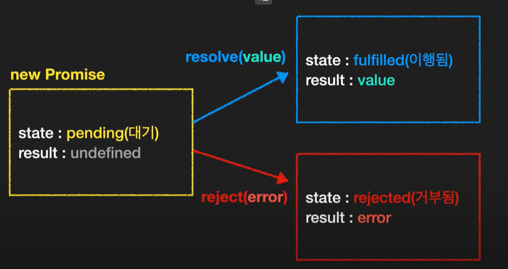

# 23-1-26 Javascript Intermediate Day 03

## 자바스크립트 중급

> [자바스크립트 중급 강좌 #1 - 변수, 호이스팅, TDZ(Temporal Dead Zone) - YouTube](https://www.youtube.com/watch?v=ocGc-AmWSnQ&list=PLZKTXPmaJk8JZ2NAC538UzhY_UNqMdZB4)

### 15. 클래스

- 메소드 오버라이딩(method overriding)

```javascript
class Car {
    constructor(color){
        this.color = color;
        this.wheels = 4;
    }
    drive() {
        console.log("drive..");
    }
    stop() {
        console.log("STOP!");
    }
}

class Bmw extends Car {
    park() {
        console.log("PARK");
    }
    stop() {
        super.stop();
        console.log("OFF");
    }
}
const z4 = new Bmw("blue");
```

### 16. Promise

```javascript
const pr = new Promise()
```



- 프로미스 기본 사용법
```javascript
const pr = new Promise((resolve, reject) => {
    setTimeout(()=>{
        resolve('OK')
    },3000)
});
```

- 프로미스 체이닝 , 프로미스 올, 프로미스 레이스

```javascript
const f1 = () =>{
    return new Promise((res, rej) => {
        setTimeout(() => {
            res("1번 주문 완료");
        }, 1000);
    });
};
const f2 = (message) =>{
    console.log(message)
    return new Promise((res, rej) => {
        setTimeout(() => {
            res("2번 주문 완료");
        }, 3000);
    });
};
const f3 = (message) =>{
    console.log(message)
    return new Promise((res, rej) => {
        setTimeout(() => {
            res("3번 주문 완료");
        }, 2000);
    });
};

// 프로미스 체이닝 (Promise chaining)
console.log("시작");
f1()
	.then((res) => f2(res))
	.then((res) => f3(res))
	.then((res) => console.log(res));
	.catch(console.log)
	.fianally(()=>{
        console.log("끝")
    })

// Promise.all
console.time("x")
Promise.all([f1(), f2(), f3()]).then((res)=>{
    console.log(res);
    console.timeEnd("x");
});
// Promise.race - 한개라도 먼저 끝나면 실행 종료
console.time("x")
Promise.race([f1(), f2(), f3()]).then((res)=>{
    console.log(res);
    console.timeEnd("x");
});
```

### 17. async await

```javascript
async function getName(){
    return "Mike";
}

getName().then((name)=> {
    console.log(name);
});

function getName2(name){
    retrun new Promise((resolve, reject)=> {
        setTimeout(() => {
            resolve(name);
        },1000);
    });
}

async function showName(){
    const result = await getName2("Mike");
    console.log(result);
}
console.log("시작");
showName();
```

### 18. Generator

- 함수의 실행을 중간에 멈췄다가 재개 할 수 있는 기능
  - next(), return(), throw()

```javascript
function* fn(){
    console.log(1);
    yield 1;
    console.log(2);
    yield 2;
    console.log(3);
    console.log(4);
    yield 3;
    return "finish";
}
const a = fn();
```

- iterable
  - Symbol.iterator 메서드가 있다.
  - Symbol.iterator 는 iterator 를 반환해야 한다.
  - 배열, String 등도 iterable한 변수
- iterator
  - next 메서드를 가진다.
  - next 메서드는 value 와 done 속성을 가진 객체를 반환
  - 작업이 끝나면 done은 true가 된다.

- next() 에 인수 전달

```javascript
function* fn() {
    const num1 = yield "첫번째 숫자를 입력해주세요";
    console.log(num1);
    
    const num2 = yield "두번째 숫자를 입력해주세요";
    console.log(num2);
    
    return num1 + num2;
}

const a = fn()l
```

- Generator는 미리 값을 만들어 내지 않는다.

```javascript
function gen1(){
    yield "W";
    yield "o";
    yield "r";
    yield "l";
    yield "d";
}
function* gen2(){
    yield "Hello,";
    yield* gen1();
    yield "!";
}
console.log(...gen2()); // Hello, W o r l d !
```

- 제네레이터는 다른 작읍을 하다가 다시 돌아와서 next() 해주면 진행이 멈췄던 부분 부터 이어서 실행

### ES2021 자바스크립트 추가 기능

- String.replaceAll, Promise.any

```javascript
//String.replaceAll

const str1 = "Hello World";
console.log(str1.replaceAll("l","~")) // He~~o wor~d

//Promise.any - 프로미스중에 가장빠르게 이행된 객체 반환 <-> promise.race - 제일빨리 실행된
const rejPromise = new Promise((res, rej) => {
    setTimeot(() => {
        rej("fail..");   
    }, 1000);
});
const resPromise = new Promise((res, rej) => {
    setTimeot(() => {
        res("success");   
    }, 2000);
});
Promise.race([rejPromise, resPromise])
	.then(()=>console.log("성공"))
	.catch(e => console.log(e));
Promise.any([rejPromise, resPromise])
	.then(() => console.log("성공"))
	.catch(e => console.log(e));
```

- Logical assignmet Operators

```javascript
function add(num1, num2){
    num1 = num1 ||0;
    num2 ||= 0;
    console.log(num1 + num2);
}

name = name && `Hello ${name}`;
name &&= `Hello ${name}`;

let num = 0;
let a = num || 3; // 3
let b = num ?? 3; // 0
num ??= 3; // undefined나 null이 아니기때문에 0으로 나옴
```

