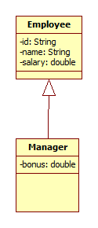

# 4/18 Java Day8

## Ch06 클래스

#### 1.3 객체간의 관계

- 관계의 종류

  - 집합 관계
    - (StarUML) Aggregation : 컴퓨터와 프린터의 관계 (불필수적)
    - (StarUML) Composition : 컴퓨터와 cpu의 관계 (필수적)
  - 사용 관계
    - ex) 예제중의 App이 Car를 사용
  - 상속 관계
    - 코드를 그대로 받아온다.

#### 1.4 객체 지향 프로그래밍의 특징

- 캡슐화(Encapsulation)
  - 데이터들을 견고하게 한다
  - Private
- 상속(inheritance)
  - 상위 객체는 자기가 가지고 있는 필드와 메소드를 하위 객체에 물려주어 하위 객체가 사용 할 수 있게 한다.
- 다형성 (Polymorphism)
  - 같은 타입이지만 실행 결과가 다양한 객체를 대입할 수 있는 성질

### II) 객체와 클래스

- 현실세계 : 설계도(UML) -> 객체
- 자바 : 클래스 -> 객체

### III) 생성자 오버로딩(overloading)

- Defult 생성자 외에 생성자를 다양하게 설정하여 생성한다.

- ※ defult constructor는 필히 만들어야 한다.

- ```java
  public Car() {
  	}
  
  	public Car(String name) {
  		this(name,"red",1000);
  	}
  
  	public Car(String name, String color) {
  		this(name,color,1000);
  	}
  
  	public Car(String name, String color, int size) {
  		this.name = name;
  		this.color = color;
  		this.size = size;
  		this.serial = cnt;
  		cnt++;
  	}
  	
  	public Car(String name, String color, int size, int serial) {
  		this.name = name;
  		this.color = color;
  		this.size = size;
  		this.serial = serial;
  	}
  ```

> \* Variable = field
>
> \* Operation = method

### III) 메소드 오버로딩

- ```java
  public void go() {
  		System.out.println(this.name+": Go !!!!");
  	}
  	public void go(int a) {
  		System.out.println(this.name+": Go !!!!" +a);
  	}
  	public void go(double b) {
  		System.out.println(this.name+": Go !!!!" +b);
  	}
  ```

  - 타입에 따른 메소드 추가

### IV) 정적 멤버와 static

- static :  class의 유일한 변수
- static이 들어가면 .(dot)으로 바로 사용 할 수 있다.

### V) 접근 제한자

- public
- protected
  - 상속관계에 있을 때만 접근 가능
- default 
  - 같은 패키지에소속된 클래스 접근 가능
- private
  - 어디서든 접근 불가

## Ch07 상속

### I) 

```java
package company;

public class Employee {
	private String id;
	private String name;
	private double salary;
	public Employee() {
	}
	public Employee(String id, String name, double salary) {
		this.id = id;
		this.name = name;
		this.salary = salary;
	}
	
	public String getId() {
		return id;
	}
	public void setId(String id) {
		this.id = id;
	}
	public String getName() {
		return name;
	}
	public void setName(String name) {
		this.name = name;
	}
	public double getSalary() {
		return salary;
	}
	public void setSalary(double salary) {
		this.salary = salary;
	}
	public double annsalary() {
		return this.salary * 12;
	}
	@Override
	public String toString() {
		return "Employee [id=" + id + ", name=" + name + ", salary=" + salary + "]";
	}

	
}
```

```java
package company;

public class Manager extends Employee{
	private double bonus;

	public Manager() {
	}

	public Manager(String id, String name, double salary, double bonus) {
		super(id, name, salary);
		this.bonus = bonus;
	}

	public double getBonus() {
		return bonus;
	}

	public void setBonus(double bonus) {
		this.bonus = bonus;
	}

	@Override
	public String toString() {
		return "Manager [bonus=" + bonus + ", toString()=" + super.toString() + "]";
	}
	
}

```

- is a 관계

  - Employee is a Manager (X)

  - Manage is a Employee (O) / Manage(super class) 가 밑으로 Employee(superclass)가 올라간다



### II) Overriding

- 재정의
  - 자식 클래스에서 상속된 일부 메소드를 다시 수정

```java
// 재정의 - overriding 
	@Override
	public double annsalary() {
		double sum = 0.0;
		//sum = salary * 12 + this.bonus;
		sum = super.annsalary() + this.bonus;
		return sum;
	}

```

- 우클릭->source->Override/implement Methods->원하는 항목 선택

### III) heterogeneous

- 배열안에 하위 개념 클래스의 타입들을 한꺼번에 관리

- ```java
  package company;
  
  public class CompanyApp2 {
  
  	public static void main(String[] args) {
  		// heterogeneous collection
  		Employee e[] = new Employee[4];
  		e[0] = new Employee("100","Kim", 1000);
  		e[1] = new Employee("101","lee", 1000);
  		e[2] = new Manager("102", "hong", 1000, 500);
  		e[3] = new Manager("103", "jin", 1000, 800);
  		
  		for (int i = 0; i < e.length; i++) {
  			System.out.println(e[i]);
  			System.out.println(e[i].annsalary());
  		}
  		for (int i = 0; i < e.length; i++) {
  			if((e[i] instanceof Manager)) {
  				Manager m = (Manager)e[i];
  				System.out.println(m.getBonusTax());
  			}
  			
  		}
  	}
  
  }
  ```

- *★★instanceof* : 객체들을 비교 할때 사용
