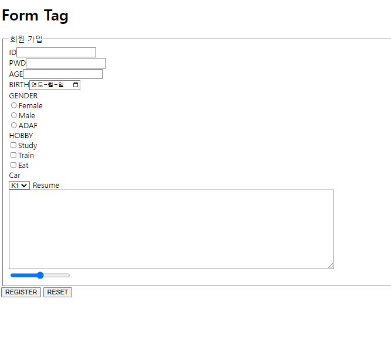
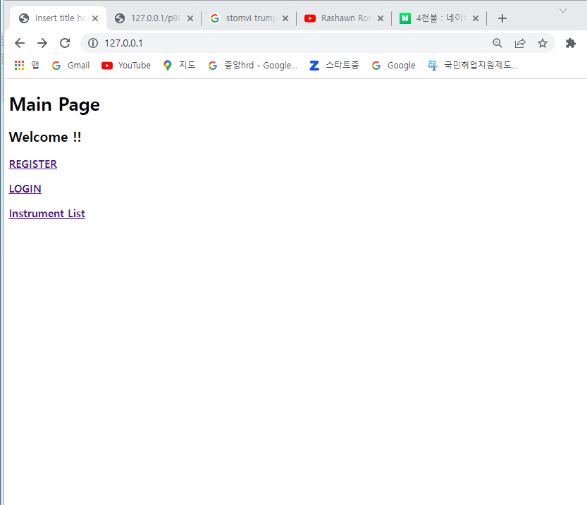
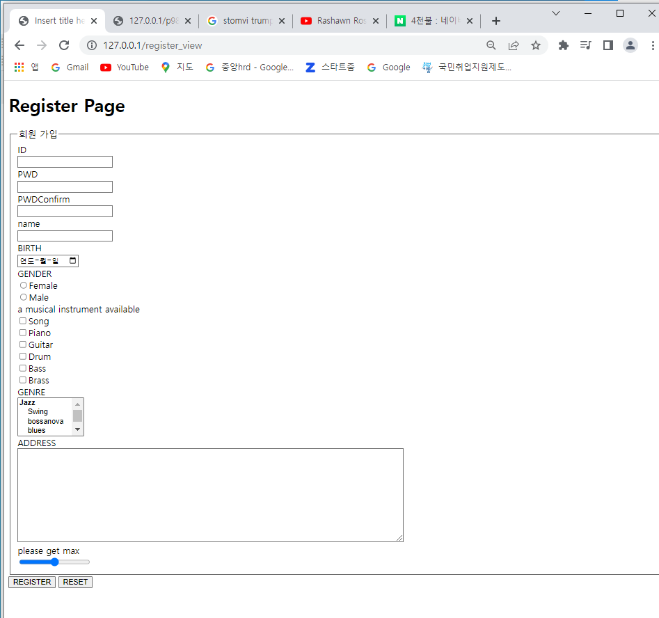
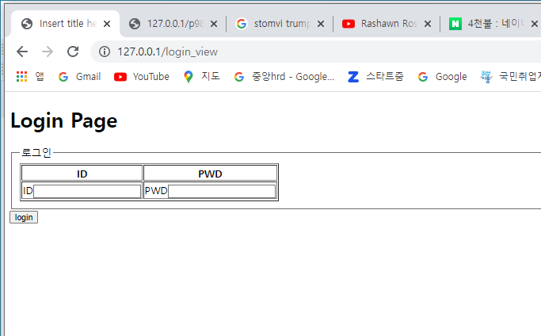
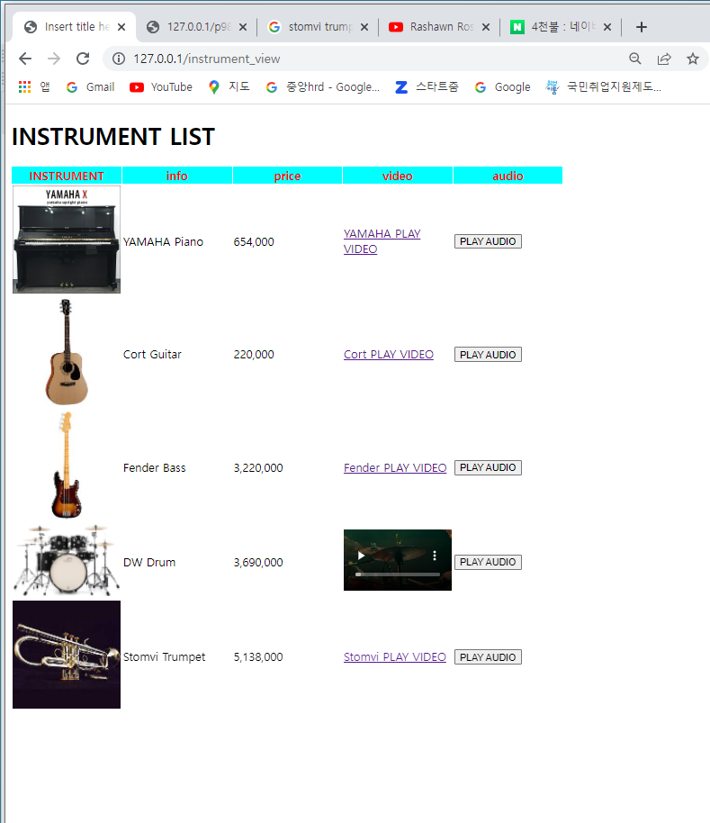

# 5/11 JavaWeb Day2

> 자바 STS 환경 설정
>
> - Encoding.UTF8 속성
> - `euc-kr` 방식은 원래 영어만을 고려한 1byte 길이의 `ASCII` 라는 인코딩 방식을 확장하여 **한글**을 사용할 수 있도록 만든 2byte 길이의 **국가 언어 코드**입니다.
> - 이를 해결하기 위해 새로운 인코딩 방식이 개발되었는데, 그중 가장 보편화된 인코딩이 `UTF-8`입니다. (3byte)
>
> System - Preferences - Web - HTML Files -Encoding - "ISO 10646/Unicod(**UTF**-**8**)"로 드롭다운리스트에서 선택

## Ch.02 웹 페이지 기본 구조와 작성 방법

- 주석
  - <!-- Comments -->

- lang 속성
  - <html lang ="ko">
  - 웹 페이지 정보를 나타 냄


## Ch.03 HTML5 기본 태그

### 1. 글자 태그

- h : 제목
- p : 단락
- br : 줄 바꿈
- hr : 수평 줄

- 특수 문자 표기
  - ```html
    &nbsp; : 공백
    &lt; : <

#### 앵커 태그

```html
<a href="http://www.naver.com">Click</a>
<!-- href는 hyper reference를 의미 --!>
```

> 테마와 폼을 제공하는 사이트 :https://getbootstrap.com/

- 빈링크

- ```html
  <a href="#">Click</a>
  <!-- 한번 확인 버튼을 출력시키거나 할때 사용 --!>
  ```

#### 글자 태그 실습

```html
<!DOCTYPE html>
<html lang ="ko">
<head>
<meta charset="EUC-KR">
<title>Insert title here</title>
<script>
	function go(){
		var c = confirm('Are You go .. Naver');
		if(c == true){
			location.href='http://www.naver.com';
		};
	};
</script>
</head>
<body>
	<!-- Comments -->
	<h1>Main &nbsp;&nbsp;&nbsp;Page</h1>
	<p>Paragr&lt;aph</p>
	<a href="http://www.naver.com">Click</a>
	<a href="#" onclick="go();">Click</a>
	<h2>Main Page</h2>
</body>
</html>
```

### 2. 목록태그

- ul : 순서가 없는 목록 생성
- ol : 순서가 있는 목록 생성
- li : 목록 요소 생성

#### 목록 태그 실습

```html
<!DOCTYPE html>
<html>
<head>
<meta charset="UTF-8">
<title>Insert title here</title>
<style>
	a{
		text-decoration: none;
		color:black;
	}
	ol,ul{
		list-style: none;
	}
	ol > li{
		float:left;
		margin:10px;
	}
</style>
</head>
<body>
	<h1>list tag</h1>
	<ol>
		<li><a href="">First</a></li>
		<li><a href="">Second</a></li>
		<li><a href="">Third</a></li>
	</ol>
</body>
</html>
```

### 3. 테이블 태그

- table : 표 삽입
- tr : 표에 행 삽입
- th : 표의 제목 셀 생성
- td : 표의 일반 셀 생성

> HTML은 아주 순수하게 코딩을 하자 왜냐하면 모바일, 또는 다른 환경에서 상대적으로 변하기 위함.
>
> 복잡한 코딩은 CSS에서 처리

- rowspan : 셀의 높이 지정, 2개의 로우를 merge
- colspan : 셀의 너비 지정, 2개의 컬럼을 merge

#### 테이블 태그 실습

```html
<!DOCTYPE html>
<html>
<head>
<meta charset="UTF-8">
<title>Insert title here</title>
<style>
	table > thead > tr > th{
		color:red;
	}
</style>
</head>
<body>
	<h1>Table</h1>
	<table border="1" width="300px">
		<thead>
			<tr><th>id</th><th>name</th><th>age</th></tr>
		</thead>
		<tbody>
			<tr><td>id01</td><td>lee</td><td>10</td></tr>
			<tr><td>id02</td><td>kim</td><td>20</td></tr>
			<tr><td rowspan="2">id03</td><td colspan="2">na</td></tr>
			<tr><td>hong</td><td>40</td></tr>
		</tbody>
	</table>
</body>
</html>
```

### 4. 미디어 태그

- img 태그
  - src : 이미지 경로지정
  - alt : 이미지가 없을 때 나오는 글자 지정
  - width : 너비 지정
  - height : 높이 지정
- audio, video 태그
  - src : 음악, 비디오 경로지정
  - preload : 음악, 비디오를 준비 중일 때 데이터를 모두 불러올지 여부 지정
  - autoplay : 음악, 비디오의 자동 재생 여부 지정
  - loop : 음악, 비디오의 반복 여부 지정
  - controls : 음악, 비디오 재생도구 출력 여부 결정
- video 태그
  - width : 너비 지정
  - height : 높이 지정

#### 미디어 태그 실습

```html
<!DOCTYPE html>
<html>
<head>
<meta charset="UTF-8">
<title>Insert title here</title>
<style>
	img{
		width:250px;
		border:2px solid red;
	}
</style>
</head>
<body>
	<h1>media tag</h1>
	
	<a href=""></a>
	<br>
	<video src="mv/movie.mp4" controls="controls"></video>
</body>
</html>
```

## Ch.04 HTML5 입력 양식 태그와 구조화 태그

### 1. 입력 양식 태그

- form 태그
  - 반드시 서버의 데이터 저장 공간이 존재해야 함

- 입력 양식 종류
  - form : 입력 양식의 시작과 끝 표시
    - action : 데이터를 전달할 목적지
    -  method : 전송 방식
      - GET : 주소에 데이터를 직접 입력해 전달
      - POST : 별도의 방법을 사용해 데이터를 해당 주소로 전달
        - POST 방식은 보안상 유리

#### 기본 form tag 실습

```html
<!DOCTYPE html>
<html>
<head>
<meta charset="UTF-8">
<title>Insert title here</title>
</head>
<body>
	<h1>Form tag</h1>
	<form action="register" method="get">
		<label for="">ID</label>
		<input id = "iid" type="text" name="id"><br>
		<label for="">PWD</label>
		<input id ="ipwd" type="password" name="pwd"><br>
		<label for="">AGE</label>
		<input id ="iage" type="number" name="age"><br>
		<input type="submit" value="register">
	</form>
</body>
</html>
```


- input
  - text : 글자 입력 양식 생성
  - button : 버튼 생성
  - checkbox : 체크박스 생성
  - file : 파일 입력 양식 생성
  - password : 비밀번호 입력 양식 생성
  - radio : 라디오 버튼 생성
  - reset : 초기화 버튼 생성
  - submit : 제출 버튼 생성
- textarea
  - cols/rows : 여러 행의 글자 입력 양싱 생성, cols는 너비를 지정하고 rows는 높이를 지정
- select : 선택양식 생성 
- optgroup : 옵션 그룹화
- option  : 옵션 생성
- fieldset : 입력 양식의 글부 지정
- legend : 입력 양식 그룹의 이름 지정
- label : input태그에 포커싱이 감

- range 


#### 입력양식 태그 실습

```html
<!DOCTYPE html>
<html>
<head>
<meta charset="UTF-8">
<title>Insert title here</title>
</head>
<body>
	<h1>Form Tag</h1>
	<form action="register2" method="POST">
		<fieldset>
			<legend>회원 가입</legend>
			ID<input type="text" name="id"><br>
			PWD<input type="password" name="pwd"><br>
			AGE<input type="number" name="age"><br>
			BIRTH<input type="date" name="birth"><br>
			<!-- radio -->
			GENDER<br>
			<input type="radio" name="gender" value="f">Female<br>
			<input type="radio" name="gender" value="m">Male<br>
			<input type="radio" name="gender" value="a">ADAF<br>
			<!-- 체크박스 -->
			HOBBY<br>
			<input type="checkbox" name="hobby" value="s">Study<br>
			<input type="checkbox" name="hobby" value="t">Train<br>
			<input type="checkbox" name="hobby" value="e">Eat<br>
			Car<br>
			<!--셀렉트 -->
			<select name="car">
				<option value="k1">K1</option>
				<option value="k2">K2</option>
				<option value="k3">K3</option>
			</select>
			<!-- 텍스트에어리어 -->
			Resume<br>
			<textarea name="resume" rows="10" cols="100"></textarea><br>
			<input type="hidden" name="loginid" value="leejan">
			<!-- 레인지 -->
			<input type="range" name="range" size="10" step="1"><br>
		</fieldset>
		<input type="submit" value="REGISTER">
		<input type="reset" value="RESET">
	</form>
</body>
```



#### jsp를 활용하여 연동하는 법

- Project - src/main/java - com.multi.controller패키지 생성 - MainController.java 파일 생성
- MainController.java

```java
package com.multi.controller;

import org.springframework.web.bind.annotation.RequestMapping;
import org.springframework.web.bind.annotation.RestController;
import org.springframework.web.servlet.ModelAndView;

@RestController
public class MainController {
	
	@RequestMapping("/")
	public ModelAndView main(ModelAndView mv) {
		mv.addObject("w", "Welcome !!");
		mv.setViewName("main");
		return mv;
	}
	
	@RequestMapping("/register_view")
	public ModelAndView register_view(ModelAndView mv) {
		mv.setViewName("register");
		return mv;
	}
	@RequestMapping("/login_view")
	public ModelAndView login_view(ModelAndView mv) {
		mv.setViewName("login");
		return mv;
	}
}
```

- project - src/main/webapp/WEB-INF/views

- main.jsp

```jsp
<%@ page language="java" contentType="text/html; charset=EUC-KR"
    pageEncoding="EUC-KR"%>
<%@ taglib prefix="c" uri="http://java.sun.com/jsp/jstl/core" %>
<!DOCTYPE html>
<html>
<head>
<meta charset="EUC-KR">
<title>Insert title here</title>
</head>
<body>
	<h1>Main Page</h1>
	<h2>${w} </h2>
	<h3><a href="register_view">REGISTER</a></h3>
	<h3><a href="login_view">LOGIN</a></h3>
</body>
</html>
```

- login.jsp

```jsp
<%@ page language="java" contentType="text/html; charset=EUC-KR"
    pageEncoding="EUC-KR"%>
<!DOCTYPE html>
<html>
<head>
<meta charset="EUC-KR">
<title>Insert title here</title>
</head>
<body>
	<h1>Login Page</h1>
</body>
</html>
```

- register.jsp

```jsp
<%@ page language="java" contentType="text/html; charset=EUC-KR"
    pageEncoding="EUC-KR"%>
<!DOCTYPE html>
<html>
<head>
<meta charset="EUC-KR">
<title>Insert title here</title>
</head>
<body>
	<h1>Register Page</h1>
</body>
</html>
```

#### 태그를 통한 ID 출력 

```jsp
<%@ taglib prefix="c" uri="http://java.sun.com/jsp/jstl/core" %>
```

태그를 하려면 jsp파일 본문 상단에 입력해야 한다.

- MainController.java

```java
@RequestMapping("/login")
	public ModelAndView login(ModelAndView mv,String id, String pwd) {
		if (id.equals("qqq") && pwd.equals("111")) {
			mv.addObject("ii", id);
			mv.setViewName("loginok");
		} else {
			mv.setViewName("loginfail");
		}
		return mv;
```

- loginok.jsp

```jsp
<%@ page language="java" contentType="text/html; charset=EUC-KR"
    pageEncoding="EUC-KR"%>
<%@ taglib prefix="c" uri="http://java.sun.com/jsp/jstl/core" %>
<!DOCTYPE html>
<html>
<head>
<meta charset="EUC-KR">
<title>Insert title here</title>
</head>
<body>
	<h1>LOGIN OK</h1>
	<h2>${ii} 환영합니다.</h2>
</body>
</html>
```

#### 악기 쇼핑몰 실습

- MAIN 화면



```jsp
<%@ page language="java" contentType="text/html; charset=EUC-KR"
    pageEncoding="EUC-KR"%>
<%@ taglib prefix="c" uri="http://java.sun.com/jsp/jstl/core" %>
<!DOCTYPE html>
<html>
<head>
<meta charset="EUC-KR">
<title>Insert title here</title>
</head>
<body>
	<h1>Main Page</h1>
	<h2>${w} </h2>
	<h3><a href="register_view">REGISTER</a></h3>
	<h3><a href="login_view">LOGIN</a></h3>
	<h3><a href="instrument_view">Instrument List</h3>
</body>
</html>
```

- MainController.java

```java
package com.multi.controller;

import org.springframework.web.bind.annotation.RequestMapping;
import org.springframework.web.bind.annotation.RestController;
import org.springframework.web.servlet.ModelAndView;

@RestController
public class MainController {
	
	@RequestMapping("/")
	public ModelAndView main(ModelAndView mv) {
		mv.addObject("w", "Welcome !!");
		mv.setViewName("main");
		return mv;
	}
	
	@RequestMapping("/register_view")
	public ModelAndView register_view(ModelAndView mv) {
		mv.setViewName("register");
		return mv;
	}
	@RequestMapping("/login_view")
	public ModelAndView login_view(ModelAndView mv) {
		mv.setViewName("login");
		return mv;
	}
	@RequestMapping("/instrument_view")
	public ModelAndView instrument_view(ModelAndView mv) {
		mv.setViewName("instrument");
		return mv;
	}
	
	@RequestMapping("/register")
	public ModelAndView register(ModelAndView mv,String id, String pwd,String pwdco) {
		if (id.equals("kms222") && pwd.equals("rlaals9462") && pwd.equals(pwdco)) {
			mv.addObject("ri", id);
			mv.setViewName("registerok");
		}else {
			mv.setViewName("registerfail");
			System.out.println(id+" "+ pwd);
		}
		return mv;
	}


	@RequestMapping("/login")
	public ModelAndView login(ModelAndView mv,String id, String pwd) {
		if (id.equals("qqq") && pwd.equals("111")) {
			mv.addObject("ii", id);
			mv.setViewName("loginok");
		} else {
			mv.setViewName("loginfail");
		}
		return mv;
	}

}
```

- register 화면



```jsp
<%@ page language="java" contentType="text/html; charset=EUC-KR"
    pageEncoding="EUC-KR"%>
<!DOCTYPE html>
<html>
<head>
<meta charset="EUC-KR">
<title>Insert title here</title>
</head>
<body>
	<h1>Login Page</h1>
	<form action="login" method="post">
		<fieldset>
			<legend>로그인</legend>
			<table border =1>
			<thead>
				<tr>
					<th>ID</th>
					<th>PWD</th>
				</tr>
			</thead>
			<tbody>
				<tr>
					<td>ID<input type="text" name="id"></td>
					<td>PWD<input type="password" name="pwd"></td>
				<tr>
			</tbody>
			</table>
		</fieldset>
		<input type="submit" value="login">	
	</form>
</body>
</html>
```

- LOGIN 화면



```jsp
<%@ page language="java" contentType="text/html; charset=EUC-KR"
    pageEncoding="EUC-KR"%>
<!DOCTYPE html>
<html>
<head>
<meta charset="EUC-KR">
<title>Insert title here</title>
</head>
<body>
	<h1>Login Page</h1>
	<form action="login" method="post">
		<fieldset>
			<legend>로그인</legend>
			<table border =1>
			<thead>
				<tr>
					<th>ID</th>
					<th>PWD</th>
				</tr>
			</thead>
			<tbody>
				<tr>
					<td>ID<input type="text" name="id"></td>
					<td>PWD<input type="password" name="pwd"></td>
				<tr>
			</tbody>
			</table>
		</fieldset>
		<input type="submit" value="login">	
	</form>
</body>
</html>
```

- instrument 화면



```jsp
<%@ page language="java" contentType="text/html; charset=EUC-KR"
    pageEncoding="EUC-KR"%>
<!DOCTYPE html>
<html>
<head>
<meta charset="EUC-KR">
<title>Insert title here</title>
<style>
	table > thead > tr > th{
		color:red;
		background-color:aqua;
		width:150px;
	}
</style>
<script src="js/js.js"></script>
</head>
<body>
	<h1>INSTRUMENT LIST</h1>
	<table>
		<thead>
		<tr>
			<th>INSTRUMENT</th>
			<th>info</th>
			<th>price</th>
			<th>video</th>
			<th>audio</th>
		</tr>
		</thead>
		<tr>
			<td></td>
			<td>YAMAHA Piano</td>
			<td>654,000</td>
			<td><a  href="https://www.youtube.com/watch?v=osA3FWVZ-6o">YAMAHA PLAY VIDEO</a></td>
			<td><button onclick="go()" >PLAY AUDIO</button></td>
		</tr>
		<tr>
			<td></td>
			<td>Cort Guitar</td>
			<td>220,000</td>
			<td><a  href="https://www.youtube.com/watch?v=fpfaBkx0ua4">Cort PLAY VIDEO</a></td>
			<td><button onclick="go()" >PLAY AUDIO</button></td>
		</tr>
		<tr>
			<td></td>
			<td>Fender Bass</td>
			<td>3,220,000</td>
			<td><a  href="https://www.youtube.com/watch?v=_eGEazXMKUI">Fender PLAY VIDEO</a></td>
			<td><button onclick="go()" >PLAY AUDIO</button></td>
		</tr>
		<tr>
			<td></td>
			<td>DW Drum</td>
			<td>3,690,000</td>
			<td><video src="video/drum.mp4" width="150" controls="controls"></video></td>
			<td><button onclick="go()" >PLAY AUDIO</button></td>
		</tr>
		<tr>
			<td></td>
			<td>Stomvi Trumpet</td>
			<td>5,138,000</td>
			<td><a  href="https://www.youtube.com/watch?v=fryTpqWZwgo">Stomvi PLAY VIDEO</a></td>
			<td><button onclick="go()" >PLAY AUDIO</button></td>
		</tr>
	</table>
</body>
</html>
```

