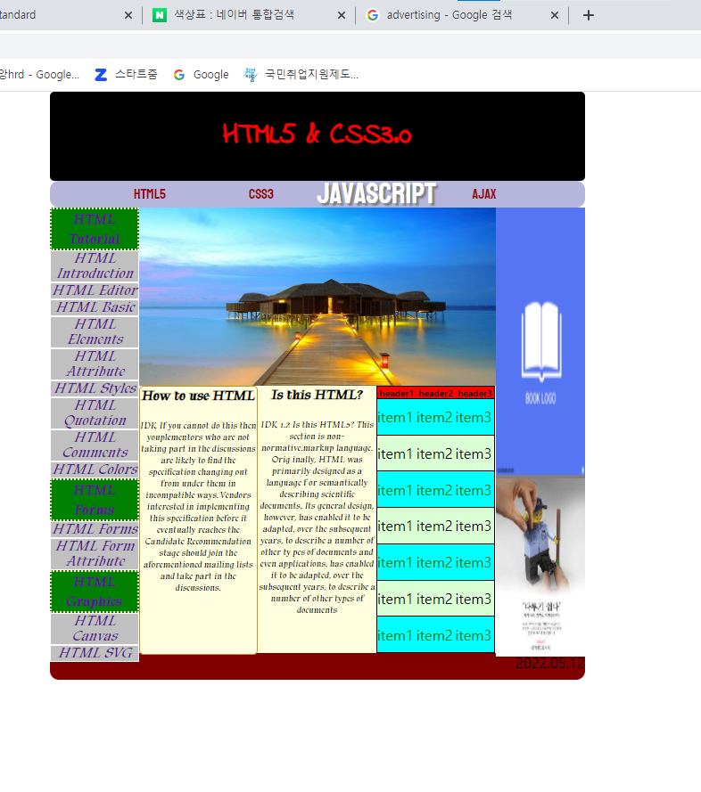

# 5/12 JavaWeb Day3

> application.properties
>
> - 웹개발에 필요한 환경에서 필요한 설정을 하는 파일
> - ex) 톰 포트 설정, SQL UML 설정 등등

## Ch.04 HTML5 입력 양식 태그와 구조화 태그

### 02. HTML5 문서 구조화

#### 공간 분할 태그

- 블록 형식 : 한 블락 (줄)의 공간을 모두 사용
  - div : 블록 형식으로 공간 분할
  - h1~6 tag
  - p tag

- 인라인 형식 : 라인(줄)안의 공간을 일부 사용
  - span : 인라인 형식으로 공간 분할
  - a tag
  - i tag

> 복잡한 화면은 css에서 구성한다.

- 시멘틱 태그
  - header : 머리말
  - nav : 하이퍼링크를 모아 둔 내비게이션
  - aside : 본문 흐름에 벗어나는 노트나 팁
  - section :문서의 장이나 절에 해당하는 내용
  - article : 본문과 독립적인 콘텐츠 영역
  - footer : 꼬리말

## Ch.05 CSS 기초: 선택자와 단위

### 1. 선택자의 용도와 사용법

- 스타일시트
- 현재는 CSS3
- CSS를 사용해 위치를 지정하고, 생상을 추가하고, 텍스트를 이동하고, 블록 수준 요소에 대한 여백 및 테두리를 설정 할 수 있다.

> [HTML관력 학습 사이트](https://www.w3schools.com/)

- id :  아이디 선택자 / 각 태그에 아이디를 지정할 수 있고 그 아이디는 #으로 가져올 수 있다.

- class : 클래스 선택자 / 동시에 그룹화하여 .@으로 가져와 설정을 한다.

- \* : 전체 선택자 / BODY안에 모든 값을 바꾼다.
- ,를 사용하면 동시에 두가지 태그를 같이 적용할 수 있다.
- header > h1 : 자손 선택자
- :hover : 반응 선택자 / 반응에 따른 설정을 지정한다.
- :nth-child(2n+1 : 구조 선택자
- 선택자의 용도와 사용법 실습

> margin, padding 은 여백을 지정하는 스타일 속성

```jsp
<%@ page language="java" contentType="text/html; charset=EUC-KR"
    pageEncoding="EUC-KR"%>
<!DOCTYPE html>
<html>
<head>
<meta charset="EUC-KR">
<title>Insert title here</title>
<style>
	*{
		margin:0; 
		padding:0;
	}
	h1{ <%-- h1은 셀렉터 --%>
		color:red;
		background:blue;
		list-style: katakana-iroha;
	}
	#hh1{
		color:blue;
		background:yellow;
	}
	.c1{
		color:green;
		background:pink;
	}
	a,p{
		color:fuchsia;
	}
	a:hover{
		color:white;
		background:black;
	}
</style>
</head>
<body>
	<h1>p105</h1>
	<h1 id="hh1">Header1</h1>
	<h1 class="c1">Header1</h1>
	<h2>Header2</h2>
	<h2 class="c1">Header2</h2>
	<a href="#">Click</a>
	<a href="#">Click</a>
	<span class="c1">Span1</span>
	<span>Span1</span>
	<p>Paragraph</p>
</body>
</html>
```

### 2. 속성 선택자

- 특정 속성과 값이 있는 태그를 선택할 때 사용
- 속성과 같은 대괄호([])를 사용

- 속성 선택자 실습

```jsp
<%@ page language="java" contentType="text/html; charset=EUC-KR"
    pageEncoding="EUC-KR"%>
<!DOCTYPE html>
<html>
<head>
<meta charset="EUC-KR">
<title>Insert title here</title>
<style>
	input[name="pwd"]{
		background:pink;
	}
	input[type="submit"]:hover{
		color: silver;
		background:window;
	}
</style>
</head>
<body>
	<h1>p135</h1>
	<form action="" method="get">
		ID<input type="text" name="id"><span>Mandatory</span><br>
		PWD<input type="password" name="pwd"><span>Mandatory</span><br>
		<input type="submit" value="login"><br>
		
	</form>
</body>
</html>
```


### 3. 후손 선택자와 자손 선택자

- 후손 선택자는 거의 사용 안함, 자손 선택자를 주로 사용

> border-collapse : 표(table)의 테두리와 셀(td)의 테두리 사이의 간격을 어떻게 처리할 지 정하는 스타일 속성

- 자손 선택자 실습

```jsp
<%@ page language="java" contentType="text/html; charset=EUC-KR"
    pageEncoding="EUC-KR"%>
<!DOCTYPE html>
<html>
<head>
<meta charset="EUC-KR">
<title>Insert title here</title>
<style>
	*{
		margin:0px;
		padding:0px;
	}
	#tb1{
		border-collapse: collapse;
		width:300px;
		height:150px;
		border:1px solid black;
	}
	#tb1 > thead > tr{
		background:black;
		color:white;
	}
	#tb1 > tbody > tr:nth-child(2n+1){
		background:gray;
		color:blacks;
	}
	#tb1 > tbody > tr >td:nth-child(3){
		text-align: right;
	}
	#tb1 > tbody > tr:hover{
		background:blue;
		color:teal;
	}
</style>
</head>
<body>
	<h1>p139</h1>
	
	<table id="tb1">
		<thead>
			<tr><th>header1</th><th>header2</th><th>header3</th></tr>
		</thead>
		<tbody>
			<tr><td>item1</td><td>item2</td><td>item3</td></tr>
			<tr><td>item1</td><td>item2</td><td>item3</td></tr>
			<tr><td>item1</td><td>item2</td><td>item3</td></tr>
			<tr><td>item1</td><td>item2</td><td>item3</td></tr>
			<tr><td>item1</td><td>item2</td><td>item3</td></tr>
			<tr><td>item1</td><td>item2</td><td>item3</td></tr>
			<tr><td>item1</td><td>item2</td><td>item3</td></tr>
		</tbody>
	</table>
</body>
</html>
```

### 4. 반응, 상태, 구조 선택자

- 반응 선택자
  - :hover : 사용자가 마우스 커서를 올린 태그 선택
  - :active : 사용자가 마우스로 클릭한 태그 선택

- 상태 선택자

- 구조 선택자

### 5. CSS3 단위

- 크기 단위
  - % : 백분율 단위
  - em : 배수 단위
  - px : 픽셀 단위

- 색상 단위
  - naver 색상표 참고 하여 삽입

- URL 단위

> CSS 주석 : /* CSS Comments */ 

> css파일 따로 구성하기
>
> project - src/main/resources - css 폴더 생성 - css 파일 생성
>
> 연결 링크
>
> <link rel="stylesheet" href="css/p139.css">

## Ch.06 CSS3 속성

### 1. 박스 속성

- div : 구역을 구분하는 속성을 가지고 있다. 블록형식의 상위 개념 /ㅂ박스

- margin 속성 : 테두리와 다른 태그 사이의 테두리 바깥쪽 여백
  - 원하는 방향의 속성만 방향 적용을 할 수 있다.
- border 속성 : 테두리
- padding 속성 : 테두리와 글자 사이의 테두리 안쪽 여백, 배경색은 padding 영역까지만 적용
  - 원하는 방향의 속성만 방향 적용을 할 수 있다.
- width 속성 : 글자를 감싸는 영역의 가로 크기
- height 속성 : 글자를 감싸는 영역의 세로 크기

- 박스 테두리
  - border-radius: 둥근 테두리 만들기
- 박스 속성 실습

```jsp
<%@ page language="java" contentType="text/html; charset=EUC-KR"
    pageEncoding="EUC-KR"%>
<!DOCTYPE html>
<html>
<head>
<meta charset="EUC-KR">
<title>Insert title here</title>
<style>
*{
	margin:0;
	padding:0;
}
div{
	width:200px;
	height:200px;
	border: 3px dotted red;
	border-radius: 50px 10px 0 10px;
	margin: 20px 10px 5px 50px;
	padding: 10px;
}
</style>
</head>
<body>
	<h1>p159</h1>
	<div><span>TEXT</span></div>
</body>
</html>
```

### 2. 가시 속성

- display 속성을 바꿔 줄 수 있다.

  - none : 화면에 보이지 않음

  - block 블록 박스 형식으로 지정

  - inline : 인라인 박스 형식으로 지정

  - inline-block : 블록과 인라인 중간 형태로 지정
    - width ,height 속성을 지정할 수 있다.

- visibility: hidden; 은 형태는 유지한채 내용을 없애준다.

- 가시 속성 실습

```jsp
<%@ page language="java" contentType="text/html; charset=EUC-KR"
    pageEncoding="EUC-KR"%>
<!DOCTYPE html>
<html>
<head>
<meta charset="EUC-KR">
<title>Insert title here</title>
<style>
*{
	margin:0;
	padding:0;
}
div{
	width:200px;
	height:200px;
	border: 3px dotted red;
	border-radius: 50px 10px 0 10px;
	margin: 20px 10px 5px 50px;
	padding: 10px;
}
p{
	/*display: none;*/
	/*visibility: hidden;*/
	display : inline-block;
	width:100px;
}
</style>
</head>
<body>

	<span>Span1</span><span>Span2</span>
	<p>paragraph</p>
	<span>Span3</span><span>Span4</span>
	<h1>p159</h1>
	<div><span>TEXT</span></div>
</body>
</html>
```

### 3. 배경 속성

### 4. 글자 속성

> [★폰트를 가져오는 사이트](fonts.google.com)

```jsp
<%@ page language="java" contentType="text/html; charset=EUC-KR"
    pageEncoding="EUC-KR"%>
<!DOCTYPE html>
<html>
<head>
<meta charset="EUC-KR">
<title>Insert title here</title>
<link rel="preconnect" href="https://fonts.googleapis.com">
<link rel="preconnect" href="https://fonts.gstatic.com" crossorigin>
<link href="https://fonts.googleapis.com/css2?family=Koulen&family=Oleo+Script+Swash+Caps&display=swap" rel="stylesheet">
<style>
*{
	margin:0;
	padding:0;
}
div{
	width:200px;
	height:200px;
	border: 3px dotted red;
	border-radius: 50px 10px 0 10px;
	margin: 20px 10px 5px 50px;
	padding: 10px;
}
p{
	/*display: none;*/
	/*visibility: hidden;*/
	display : inline-block;
	width:100px;
	font-family: 'Koulen', cursive;
}
span{
	font-family: 'Oleo Script Swash Caps', cursive;
}
</style>
</head>
<body>

	<span>Span1</span><span>Span2</span>
	<p>paragraph</p>
	<span>Span3</span><span>Span4</span>
	<h1>p159</h1>
	<div><span>TEXT</span></div>
</body>
</html>
```

- css 파일에서의 폰트 import 하는법

```java
@charset "EUC-KR";
@import url('https://fonts.googleapis.com/css2?family=Koulen&family=Oleo+Script+Swash+Caps&display=swap');
/* 2022.05.12 */
	*{
		margin:0px;
		padding:0px;
	}
	#tb1{
		border-collapse: collapse;
		width:300px;
		height:150px;
		border:1px solid black;
	}
	#tb1 > thead > tr{
		background:black;
		color:white;
		font-family: 'Koulen', cursive;
	}
	#tb1 > tbody > tr:nth-child(2n+1){
		background:gray;
		color:blacks;
	}
	#tb1 > tbody > tr >td:nth-child(3){
		text-align: right;
	}
	#tb1 > tbody > tr:hover{
		font-family: 'Oleo Script Swash Caps', cursive;
		font-size:1.2em;
		font-weight:bold;
		background:#A30B56;
		color:teal;
	}
	/* CSS Comments */
	body{
		background-color: aqua;
		background-image: url('../img/bg.jpg')
	}
```

- 버튼만들기
  - line-height : block속성의 높이를 지정한다

```jsp
<%@ page language="java" contentType="text/html; charset=EUC-KR"
    pageEncoding="EUC-KR"%>
<!DOCTYPE html>
<html>
<head>
<meta charset="EUC-KR">
<title>Insert title here</title>
<link rel="preconnect" href="https://fonts.googleapis.com">
<link rel="preconnect" href="https://fonts.gstatic.com" crossorigin>
<link href="https://fonts.googleapis.com/css2?family=Koulen&family=Oleo+Script+Swash+Caps&display=swap" rel="stylesheet">
<style>
.big_bt{
	width: 150px;
	height : 70px;
	background-color: #FF6A00;
	border: 10px solid #FFFFFF;
	border-radius: 30px;
	box-shadow: 5px 5px 5px #A9A9A9;
}
.big_bt > a{
	text-decoration: none;
	color:black;
	display:block;
	line-height: 70px;
	text-align: center;
	font-size: 2em;
	font-weight: bold;
	font-family: 'Koulen', cursive;
}
.big_bt > a:hover {
	color:yellow;
	font-family: 'Oleo Script Swash Caps', cursive;
}
.big_bt:hover {
	color:blue;
	border: 10px solid black;
}
h1{
	font-family: 'Oleo Script Swash Caps', cursive;	
}
</style>
</head>
<body>
	<h1>p189</h1>
	<div class="big_bt">
		<a href="#">Click</a>
	</div>
</body>
</html>
```

### 5. 위치 속성

- float:left; 왼쪽정렬
- opacity: 투명도 0~1로 지정 또는 %로 지정
- z-index: 0~100 요소 순서 변경
- absolute : 절대 위치 좌표 설정
- 위치 속성 실습

```jsp
<%@ page language="java" contentType="text/html; charset=EUC-KR"
    pageEncoding="EUC-KR"%>
<!DOCTYPE html>
<html>
<head>
<meta charset="EUC-KR">
<title>Insert title here</title>
<style>
.box{
	width:100px;
	height:100px;
	position: absolute;
	opacity: 0.8;
	/* float:right; */
}
.box:nth-child(1){
	background-color: red;
	left:10px;
	top: 10px;
	z-index:100;
}
.box:nth-child(2){
	background-color: blue;
	left:50px;
	top: 50px;
	z-index:10;
}
.box:nth-child(3){
	background-color: green;
	left:90px;
	top: 90px;
	z-index:20;
}
</style>
</head>
<body>
	<div class="box"></div>
	<div class="box"></div>
	<div class="box"></div>
</body>
</html>
```

### 시멘틱 태그를 이용한 시멘틱 웹 구현

- main.jsp

```jsp
<%@ page language="java" contentType="text/html; charset=EUC-KR"
    pageEncoding="EUC-KR"%>
<%@ taglib prefix="c" uri="http://java.sun.com/jsp/jstl/core" %>

<!DOCTYPE html>
<html>
<head>
<meta charset="EUC-KR">
<title>Insert title here</title>
<link rel="stylesheet" href="css/day03ws.css">
<style>
</style>
</head>
<body>
<header>
	<h1>HTML5 & CSS3.0</h1>
</header>
<nav>
	<ul>
		<li><a href="">HTML5</a></li>
		<li><a href="">CSS3</a></li>
		<li><a href="">JavaScript</a></li>
		<li><a href="">AJAX</a></li>
	</ul>
</nav>
<section>
	<aside id="left_aside">
	<a href="" class=big_bt>HTML Tutorial</a>
	<a href="" class=small_bt>HTML Introduction</a>
	<a href="" class=small_bt>HTML Editor</a>
	<a href="" class=small_bt>HTML Basic</a>
	<a href="" class=small_bt>HTML Elements</a>
	<a href="" class=small_bt>HTML Attribute</a>
	<a href="" class=small_bt>HTML Styles</a>
	<a href="" class=small_bt>HTML Quotation</a>
	<a href="" class=small_bt>HTML Comments</a>
	<a href="" class=small_bt>HTML Colors</a>
	<a href="" class=big_bt>HTML Forms</a>
	<a href="" class=small_bt>HTML Forms</a>
	<a href="" class=small_bt>HTML Form Attribute</a>
	<a href="" class=big_bt>HTML Graphics</a>
	<a href="" class=small_bt>HTML Canvas</a>
	<a href="" class=small_bt>HTML SVG</a>
	</aside>
	<aside id="center_aside">
	<article id="big_atc"></article>
	<article class = "small_atc" id ="s_a">
	<h4>How to use HTML</h4>
	<h5>&nbsp;</h5>
	<p>IDK
	If you cannot do this then youplementors who are not taking part in the discussions are likely to find the specification changing out from under them in incompatible ways. Vendors interested in implementing this specification before it eventually reaches the Candidate Recommendation stage should join the aforementioned mailing lists and take part in the discussions.
</p>
	</article>
	<article class = "small_atc" id ="s_a1">
	<h4>Is this HTML?</h4>
	<h5>&nbsp;</h5>
	<p>IDK
1.2 Is this HTML5?
This section is non-normative.markup language. Orig
inally, HTML was primarily designed as a language f
or semantically describing scientific documents. Its
 general design, however, has enabled it to be adapted, 
 over the subsequent years, to describe a number of other ty
 pes of documents and even applications. has enabled it to be adapted, over the subsequent years, to describe a number of other types of documents
 </p>
	</article>
	<article class = "small_atc">
	<table id="tb1">
		<thead>
			<tr><th>header1</th><th>header2</th><th>header3</th></tr>
		</thead>
		<tbody>
			<tr><td>item1</td><td>item2</td><td>item3</td></tr>
			<tr><td>item1</td><td>item2</td><td>item3</td></tr>
			<tr><td>item1</td><td>item2</td><td>item3</td></tr>
			<tr><td>item1</td><td>item2</td><td>item3</td></tr>
			<tr><td>item1</td><td>item2</td><td>item3</td></tr>
			<tr><td>item1</td><td>item2</td><td>item3</td></tr>
			<tr><td>item1</td><td>item2</td><td>item3</td></tr>
		</tbody>
	</table>
	</article>
	</aside>
	<aside id="right_aside">
	
	
	</aside>
</section>
<footer>2022.05.12</footer>
</body>
</html>
```

- day03wd.css 파일

```jsp
@charset "EUC-KR";
@import url('https://fonts.googleapis.com/css2?family=Indie+Flower&family=Koulen&family=Tapestry&display=swap');
/* Global CSS start ----------------------*/
*{
	margin:0;
	padding:0;
}
a{
	text-decoration: none;
	color: block;
}
ul,ol{
	list-style: none;
}
/* Global CSS end ----------------------*/

/* Hearder CSS start ----------------------*/
header{
	width:600px;
	height:100px;
	background: black;
	margin: 0 auto;
	border-radius: 5px;
}
header > h1{
	text-align: center;
	line-height: 100px;
	color: red;
	font-family: 'Indie Flower', cursive;
}
/* Hearder CSS end ----------------------*/

/* Nav CSS start ----------------------*/
nav{
	width:600px;
	height:30px;
	background: #B6B5DB;
	margin: 0 auto;
	border-radius: 10px;
}
nav > ul{
	width:500px;
	margin:0 auto;
}
nav > ul > li{
	float: left;
	width: 125px;
	line-height: 30px;
}

nav > ul > li > a{
	display: block;
	color:#970505;
	text-align: center;
	font-family: 'Koulen', cursive;
}
nav > ul > li > a:hover{
	text-transform:capitalize;
	color:white;
	font-size:2em;
	text-shadow: 3px 3px 2px gray;
}
/* Nav CSS end ----------------------*/

/* Section CSS start ----------------------*/
section{
	width:600px;	
	height:500px;
	background: white;
	margin: 0 auto;
}
section > aside{
	float: left;
}
section > #left_aside{
	width:100px;	
	height:500px;
	background: gray;
	border-radius: 5px;
}
section > #left_aside > .big_bt{
	display:block;
	font-weight:bolder;
	background: green;
	font-size: 16px;
	text-align: center;
	line-height: 22px;
	font-family: 'Tapestry', cursive;
	border: dotted 2px #FAF4C0;
}
section > #left_aside > .small_bt{
	display:block;
	font-weight:lighter;
	font-style:italic;
	background: silver;
	font-size: 14;
	text-align: center;
	line-height: 17px;
	font-family: 'Tapestry', cursive;
	border: solid 1px white;
}
section > #center_aside{
	width:400px;	
	height:500px;
	background: white;
	border-radius: 5px;
}
section > #center_aside > article {
	float:left;
	border-radius: 5px;
}
section > #center_aside >#big_atc {
	width:400px;
	height:200px;
	background: yellow;
}
section > #center_aside > .small_atc {
	width:133.3px;
	height:300px;
	background: #FFFFDF;
}
section > #center_aside >#s_a{
	width:131.2px;
	border: 1px solid #BC952B;
}
section > #center_aside > .small_atc > h4{
	text-align: center;
	font-family: 'Tapestry', cursive;
}
section > #center_aside > .small_atc > p{
	text-align: center;
	font-size:xx-small;
	font-family: 'Tapestry', cursive;
}

section > #center_aside > .small_atc > #tb1{
	border-collapse:collapse;
	width:133.3px;
	height:300px;
	background: #DBFFD5;
	border: 1px solid black;
}
section > #center_aside > .small_atc > #tb1> thead > tr{
	background: red;
	color: black;
	font-size: xx-small;
	border: 1px solid black;
}
section > #center_aside > .small_atc > #tb1> tbody > tr:nth-child(2n+1){
	background: aqua;
	color: green;
	border: 1px solid black;
}
section > #right_aside{
	width:100px;	
	height:500px;
	background: gray;
	border-radius: 5px;
}
/* Section CSS end ----------------------*/

/* Footer CSS start ----------------------*/
footer{
	width:600px;	
	height:30px;
	background: maroon;
	margin: 0 auto;
	border-radius: 0 0 10px 10px;
	text-align: right;
}
/* Footer CSS end ----------------------*/
```


