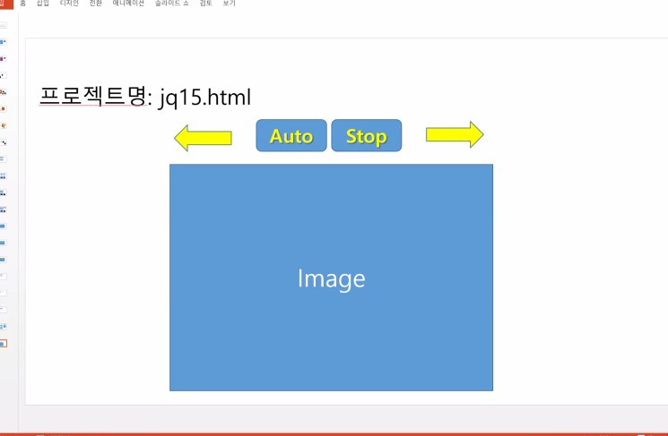
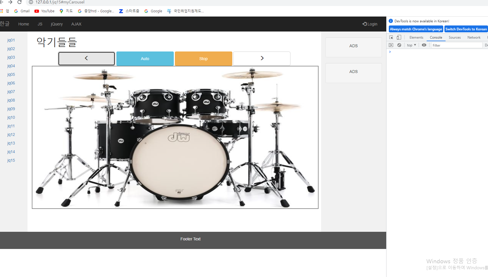

# 5/18 JavaWeb Day7

## jQuery

### 1. 함수

- jQuery로 for문

#### 1. show/hide

- .slideDown/Up 
- .fadeIn/Out
- .show/hide (toggle도 가능  (켰다 껐다))

```html
<meta charset="UTF-8">
<style>
	#result{
		width:300px;
		border: 2px solid red;
	}
</style>
<script>
	function display(d){
		var txt = '';
		$(d).each(function(index,item){ // for문
			txt += '<h3>';
			txt += item.id + ' '+ item.name+' '+item.age;
			txt += '</h3>';
		})
		/*
		for(var i in d){
			txt += '<h3>'
			txt += d[i].id+' '+d[i].name+' '+d[i].age;
			txt += '</h3>'	
		}
		*/
		$('#result').html(txt);
	};
	function getdata(){
		var data = [
			{id:'id01',name:'lee',age:10},
			{id:'id02',name:'hong',age:20},
			{id:'id03',name:'lim',age:30},
			{id:'id04',name:'kang',age:40},
			{id:'id05',name:'ho',age:50}
		];
		display(data);
	};
	$(document).ready(function(){
		$('#getdata').click(function(){
			getdata();
		});
		$('#show').click(function(){
			$('#result').fadeIn();
		});
		$('#hide').click(function(){
			$('#result').fadeOut();
		});
	});
</script>
<h1>JQ 05</h1>

<button id="getdata">GET DATA</button>
<button id="show">Show</button>
<button id="hide">Hide</button>

<div id="result"></div>
```

#### 2 .jQ HTML Get/Set Content And Attributes

- .txt()
  - 텍스트 값을 가져온다.
- .attr()
  - 해당 Element의 속성 값을 가지고 온다.
- .html()
  - HTML 스트링으로 받아온다.
- .val()

```html
<meta charset="UTF-8">

<script>
$(document).ready(function(){
	var txt = $('h1').text();
	txt += ':New';
	$('h1').text(txt);
	
	$('h2 > a').attr('href','http://www.naver.com');
});
</script>

<h1>JQ 06</h1>

<h1>Header1</h1>
<h2><a href="#">Click</a></h2>
<form>

</form>
```

- 회원가입 실습

```html
<meta charset="UTF-8">
<script>
function getdata(){
	$('#name').val('lee');
	$('#name').attr('disabled','disabled');
	$('#pwd').val('1111');
	$('input[name="ch"]:checkbox[value="op1"]').attr('checked',true);
	$('input[name="ch"]:checkbox[value="op3"]').attr('checked',true);
	$('input[name="optradio"]:radio[value="op3"]').attr('checked',true);
	$('#sel').val('2').attr('selected','selected');
};
$(document).ready(function(){
	getdata();
	$('#name_help').hide();
	$('#pwd_help').hide();
	
	$("#register_bt").click(function(){
		
		var name = $('#name').val();
		var pwd = $('#pwd').val();
		
		if(name == ''){
			$('#name_help').show();
			$('#name').focus();
			return;
		}
		if(pwd == ''){
			$('#pwd_help').show();
			$('#pwd').focus();
			return;
		}
		$("#register_form").attr({
			'action':'registerimpl',
			'method':'get'
			});
		$("#register_form").submit();
	});
	$('#name').keyup(function(){
		$('#name_help').hide();
	});
	$('#pwd').keyup(function(){
		$('#pwd_help').hide();
	});
	
	/*
	$('#name').blur(function(){
		var name = $('#name').val();
		if(name != ''){
			$('#name_help').hide();
		};
	});
	
	$('#pwd').blur(function(){
		var pwd = $('#pwd').val();
		if(pwd != ''){
			$('#pwd_help').hide();
		};
	});
	*/
});
</script>

<div class ="container col-sm-6">
	<h1>Register</h1>	
	<form id="register_form">
	<div class="form-group">
      <label for="name">Name:</label>
      <input type="text" name= "name" class="form-control" id="name" placeholder="Input name">
   	  <span id="name_help" class="help-block">This is Mandatory Field...</span>
    </div>
    <div class="form-group">
      <label for="pwd">Password:</label>
      <input type="password" name="pwd" class="form-control" id="pwd">
      <span id="pwd_help" class="help-block">This is Mandatory Field...</span>
    </div>
    <div class="form-group">
	    <label class="checkbox-inline"><input type="checkbox" name="ch" value="op1">Option 1</label>
		<label class="checkbox-inline"><input type="checkbox" name="ch" value="op2">Option 2</label>
		<label class="checkbox-inline"><input type="checkbox" name="ch" value="op3">Option 3</label>
	</div>
	<div class="radio">
	  <label><input type="radio" name="optradio" value="op1" checked>Option 1</label>
	</div>
	<div class="radio">
	  <label><input type="radio" name="optradio" value="op2">Option 2</label>
	</div>
	<div class="radio">
	  <label><input type="radio" name="optradio" value="op3">Option 3</label>
	</div>
	<div class="form-group">
	  <label for="sel1">Select list:</label>
	  <select class="form-control" id="sel" name="sel">
	    <option value="1">1</option>
	    <option value="2">2</option>
	    <option value="3">3</option>
	    <option value="4">4</option>
	  </select>
	</div>
	<button id="register_bt" type="button" class="btn btn-link">REGISTER</button>
	</form>
</div>
```

#### 3. JQ Add/Remove Elements/Content

- Elements 추가
  - .append()
    - Elements 영역 가장 뒷 부분에 추가
  - .prepend()
    - Elements 영역 가장 앞 부분에 추가
  - .after()
    - 특정 Elements 앞에 추가
  - .before()
    - 특정 Elements 뒤에 추가
- Elements 삭제
  - .remove()
    - Elements 자체를 삭제
  - .empty()
    - Elements 내용만 삭제

#### 4. JQ Get and set Css Classes

- .addClass();
- .removeClass();

#### 5. JQ Traversing Filtering

> 동시에 여러 개의 Element를 선택 하였을 때 특정 위치의 속성을 지정 할 수 있다.

- .first()
  - 첫번째 선택
- .last()
  - 두번째 선택
- .eq(n)
  - n번째 선택
- filter('.intro')
  - 특정 속성만 선택
- .not(n)
  - 을 제외하고 나머지 모두를 선택

#### 3~5 실습

```html
<meta charset="UTF-8">
<style>
	#result{
		border: 2px solid red;
	}
	.myclass{
		color:red;
		background:black;
	}
</style>
<script>
$(document).ready(function(){
	/*
	$('h1').css({
		'color':'red',
		'background':'black'
	});
	*/
	$('h1').hover(function(){
		$(this).addClass('myclass');
	},function(){
		$(this).removeClass('myclass');
	});
	
	var i = 1;
	// Element를 추가

	$('#append').click(function(){
		$("#result").append('<h4>Add Element.....'+i+'</h4>');
		i++;
		$('button').addClass('myclass');
		$('button').not($(this)).removeClass('myclass');
	});
	$('#prepend').click(function(){
		$("#result").prepend('<h4>Add Element.....'+i+'</h4>');
		i++;
		$('button').addClass('myclass');
		$('button').not($(this)).removeClass('myclass');
	});
	$('#after').click(function(){
		$("#result").after('<h4>Add Element.....'+i+'</h4>');
		i++;
		$('button').addClass('myclass');
		$('button').not($(this)).removeClass('myclass');
	});
	$('#before').click(function(){
		$("#result").before('<h4>Add Element.....'+i+'</h4>');
		i++;
		$('button').addClass('myclass');
		$('button').not($(this)).removeClass('myclass');
	});
	// Element를 삭제
	$('#remove').click(function(){
		$('#result').remove();
		$('h4').remove();
		$('button').addClass('myclass');
		$('button').not($(this)).removeClass('myclass');
	});
	$('#empty').click(function(){
		$("#result").empty();
		$('button').addClass('myclass');
		$('button').not($(this)).removeClass('myclass');
	});
});
</script>
<h1>JQ 09</h1>
<button id ="append">append</button>
<button id ="prepend">prepend</button>
<button id ="after">after</button>
<button id ="before">before</button>
<button id ="remove">remove</button>
<button id ="empty">empty</button>
<hr>
<div id="result">
</div>
```

#### 6. 애니메이션 효과

- .animate(속성 객체);

```html
<meta charset="UTF-8">

<script>
$(document).ready(function(){
	$('#box').css({
		'width': '100px',
		'height':'100px',
		'background':'red'
	}).animate({
		'width':'500px',
		'opacity':'0.6'
	},500);
});
</script>
<h1>JQ 10</h1>

<div id="box"></div>
```

#### 7. 시간별 이미지 전환

```html
<meta charset="UTF-8">
<script>
$(document).ready(function(){
	var imgs = ['img/bass.jpg','img/drum.jpg','img/guitar.jpg','img/piano.jpg','img/trumpet.jpg'];
	var cnt = 0;
	setInterval(function(){
		$('#image').attr('src',imgs[cnt % imgs.length]);
		$('h1').text(cnt);
		cnt++;
		
	}, 1000)
});
</script>
<h1>JQ 12</h1>

```

#### 8. 무한스크롤

```html
<meta charset="UTF-8">
<style>
#simg{
	width:600px;
	height: 150px;
	margin: 5px;
}
</style>
<script>
$(document).ready(function(){
	function getdata(){
		for(var i=0; i<11; i++){
			$('#data').append('');	
		};
		
	};
	getdata();
	$(window).scroll(function(){
		
		/*
		$('h1').text($(document).height()+' '
				+$(window).scrollTop()+' '+$(window).height());
		*/
		if($(document).height() <= $(window).scrollTop()+$(window).height()){
			getdata();
		};
	});
});
</script>
<h1>JQ 13</h1>

<div id="data"></div>
```

##### 이미지 자동 넘기기 실습



```html
<meta charset="UTF-8">
<style>
	#bts{
		text-align: center;
	}
	button{
		width: 200px;
		height: 50px;
	}
	#img{
		width: 1000px;
		height: 500px;
		border: 2px solid gray;
	}
</style>
<script>

$(document).ready(function(){
	var imgs = ['img/bass.jpg','img/drum.jpg','img/guitar.jpg','img/piano.jpg','img/trumpet.jpg'];
	var mi = 0;
	function getdata(){
		$('#img').attr('src',imgs[mi])
	};
	getdata();
	$('#auto').click(function(){
		var cnt = 0;
		var seti = setInterval(function(){
			$('#img').attr('src',imgs[cnt % imgs.length]);
			cnt++;
		}, 500);
		$('#stop').click(function(){
			clearInterval(seti)
		});	
	});
	$('#prev').click(function(){
		mi--;
		getdata();
	});
	$('#next').click(function(){
		mi++;
		getdata();
	});
});
</script>
<div class = "container">
<h1>악기들들</h1>
</div>
<div id="bts">
	<button type="button" id ="prev"class="btn btn-default btn-lg">
 	 <span class="glyphicon glyphicon-menu-left" aria-hidden="true"></span>
	</button>
	<button type="button" id ="auto" class="btn btn-info">Auto</button>
	<button type="button" id ="stop" class="btn btn-warning">Stop</button>
 	<button type="button" id ="next" class="btn btn-default btn-lg">
 	 <span class="glyphicon glyphicon-menu-right" aria-hidden="true"></span>
	</button>
</div>
<div>
	
</div>
```

