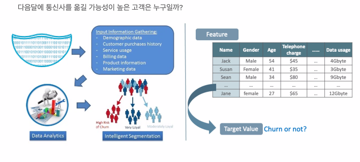

# 7/2 Mentoring 01

> 1. 멘토링 소개 및 세미나
> 2. Final Project 계획 구성 및 설정
> 3. 개인적인 질문 : 단기간 개발교육을 통해 입문, 기술위주 지식을 습득하다 보니 사용하는 기술 외의 (사실 사용하는 기술 마저도) ,그 외의 기술의 이해, (한가지의 언어나 기술이 아닌)전반적인 배경지식의 부재를 느끼는데 그런것들을 효과적으로 습득할 자료 또는 방법이 있을까요?
>    - 최근 책을 사러 갔는데 마땅한 자료를 찾지 못함
>    - 유튜브에서는 미시적인 흐름이나 자료들밖에 찾지 못함
>    - 정보처리기사 시험 준비는 각각의 정의와 지식들을 습득하기는 좋지만 관계적인 흐름의 이해가 자세하고 명확하게 설명되어있지 않다는 느낌

## 1. 멘토링 소개

1. 박재진 (이하 P)
2. 송규호 (이하 S)
   1. MOCOCO
   2. KT DS
   3. ORACLE
   4. AWS

## 2. 세미나

#### S. 멘토 데이터 베이스 세미나

- 데이터베이스가 없던 시절

  - 파일에 데이터를 저장
  - 동시에 여러명이 하나의 파일을 사용하기 어려움
  - 파일이 자주 깨짐
  - 한정된 디스크 공간에 중복된 데이터가 많이 존재함

- 관계형 데이터 베이스의 탄생

  - 데이터를 정규화해서 저장 공간을 줄임
  - 여러 사용자가 같은 데이터를 사용해도 문제가 발생하지 않게 설계
  - 저장된 데이터가 깨지지 않게 하기 위한 여러가지 매커니즘을 도입
  - 데이터 처리에 특화된 Language(Query)를 도입해서 처리를 용이하게 함
  - 데이터 처리 속도를 개선하기 위한 여러가지 기술들을 도입(Optimizer, index, partition등)
  - Lock 매커니즘을 도입해서 트랜잭션 처리가능
  - **OLTP**(온라인 트랜잭션 처리)는 온라인 뱅킹, 쇼핑, 주문 입력 또는 텍스트 메시지 전송 등 동시에 발생하는 다수의 트랜잭션을 실행하는 데이터 처리 유형
  - ? 그러나, 결산 작업이나 보고서 작성을 위한 요약이 필요하다면?

- 데이터웨어하우스(DW)

  - 

  - 대용량 데이터 처리에 용이한 구조를 가진 DW를 도입해서
  - Silo 되어 있던 데이터를 모아서 커다란 데이터 베이스(DW)에 모으고,
  - Rich한 분석 기능들을 사용해서 다양한 Dimension/View(성별,지역별,세대별,...)로 데이터를 볼 수 있는 결과(데이터 마트)를 만든다.
  - 생성된 데이터 마트를 이용해서 시각화(BI)를 해서 한눈에 현재의 Business 상황을 확인 할 수 있게 한다.
  - ? 그러나, 데이터가 더 커진다면? 혹은 비정형 데이터(텍스트, 음성, 사진)라면? 

- 빅데이터 ERA

  - 

  - 데이터를 잘라서 여러대의 컴퓨터에 분산 저장하고
  - 다양한 도구들을 사용해서 병렬 처리한다.
  - 비정형 데이터도 처리 가능하고
  - SQL도 쓸 수 있고 Python도 쓸 수 있고 Java도 쓸 수 있다.
  - ? 그러나, 알파고가 나온다면?

- 딥러닝의 탄생

  - 딥러닝 기술의 발전으로 Machine learning과 AI 기술이 보편화됨
  - 하둡은 전처리 머신으로 전락
  - 데이터를 샘플링하는 방식의 전통적인 통계 솔루션(SAS, R, SPSS)들의 몰락
  - 빅데이터 기술을 기반으로한 저렴한 데이터 레이크에 모아둔 막대한 데이터를 이용한 정교한 데이터 학습
  - 데이터 분석 기법/방법들에 대한 활발한 교류 및 프레임워크들의 눈부신 발전 속도
  - GPU와 클라우드 기술을 활용한 머신러닝용 하드웨어

- 기술의 진보 (Machine Learning For Everyone)
  - 편리하고 쉽게 기술을 배울 수 있게 되고 있다.
  - 

#### 일반적인 데이터 분석 절차

- 현실세계의 머신러닝
  - 

- 머신러닝 데이터 처리 과정

- 머신러닝 데이터 처리 과정 / EDA
  - 

- 머신러닝 데이터 처리 과정 / ETL
  - 데이터 전처리 과정이라고 함
  - 

- 머신러닝 데이터 처리 과정 / FEATURE ENGINEERING

- 머신러닝 데이터 처리 과정 /DATA MART & 시각화

- 머신러닝 데이터 처리 과정 /MODEL TRAINING

## 3. 질의 응답

- 시간 오래 대기업 or 작은 회사 경력?
  - P : 상관 No! Because IT업계는 이직에 관대 / 수요는 넘쳐난다.
  - S : 자기가 어떤 커리어를 가져가고 싶은지? / 개발자나 IT 엔지니어로 성장 하고 싶다면, 유행하는, 사용성이 많은 기술을 다루고 있는 강소기업을 지원 추천 or 개발자 no 안정적이고 프로젝트 관리 또는 사람을 다루는 위치를 원하면 대기업이나 관리직 추천
-  기본적인 학벌, 학점, 어학 점수?
  - P : 영어 점수는 좀 본다. Beacause 구글에게 물어볼 때 영어로 물어보는 경우가 많기 때문 
  - S : 아예 안봄 / IT업계에 대한 기술적인 부분들 질문 (Ex. Database 챠딩/ Spring Mvi??)
- 비전공자를 보는 시선?
  - P : 라이언 달 (Node.ja 최초 개발자)도 비전공자
- 신입 중 가장 선호되는 개발 스킬이나 경험
  - P : 대단한걸 기대 X, Test의 중요성 / 처음부터 끝까지 완성도 있게 무엇을 해봤는지, 깃허브에서 오픈프로젝트에 기여 , 깃허브 프로필 관리
  - S : 어떤걸 관심이 있는지, 잘하는지 / 잘하고 싶은 쪽에서 프로젝트 분야를 쌓는것이 중요, 적극성
- AWS와 같은 글로벌 기업, Senior 직급으로 성장 할 수 있는 비결? 해당 기업들의 업무 방식?
  - P : Senior와 Junior를 구분하는 차이 : 인사이트(이해, 통찰력), 경험
  - S : 엔지니어로 성장할 수 있는 가능성 : 해결하고자하는 의지, 오너쉽을 가지고 적극성, 업무 방식이나 태도 / 방향설정 (앞으로의 기대 기술을 파악 중요 EX.블록체인)
    - 업무 방식 : 개발의 양은 많지 않음, B TO B Bussiness를 많이 함
- 개발 신조 한 줄
  - P : 1. TEST / 2.리펙토링 : '결과의 변경 없이 코드의 구조를 재조정함'을 뜻한다. 1. 주로 가독성을 높이고 유지보수를 편하게 한다. 2. 버그를 없애거나 새로운 기능을 추가하는 행위는 아니다
  - S : 기술을 바라 볼때의 철학. IT는 변화가 빠름 새로운 기술을 적극적으로 따라가야 함/ 변화가 두려워질때가 올것이다. 하지만 그렇게 되면 안된다.
- 세계적으로 디지털 전환이 가속화되는 상황, 소양 / 개발을 통한 공공성 기여 사례
  - P : 커뮤니티에 속해 있어야 한다. 
  - S : **펀더멘탈**(Fundamentals) 기초, 기본, 핵심이 중요 / 기술에 매몰되지 않고 비즈니스에 대한 이해

- 빠르게 변화하는 IT업계, 어떻게 적응? / 입문자들의 공부 밥법 추천
  - P : github의 Trending / Mooc 사이트, udemy.com, 커뮤니티 추천
  - S : udemy.com , 인프런 , Mooc , 책 ,세미나, 컨퍼런스

- 개발자가 되기 위해서 코딩테스트, 준비할 때 어떤 능력을 향상시키는데 중점?

  - P : 출제자의 의도 파악 / 알고리즘을 얼마나 잘 활용, 문제의 본질에 얼마나 빨리 잘 접근 / Live coding Interview

  - S : 책이나 온라인 활용 / 직접 많이 해보는것이 중요

- 기억에 남는 프로젝트
  - P : 망한 프로젝트 Sony mylo2 . 아이폰때문에 망함 피벗(방향 전환)을 해야했음
  - S : KT Cloud 프로젝트 . Cloud 사업이 없으니 한국에서 해보자는 취지 / 사람들이 많이 나가며 새로운 서비스가 안만들어짐

- 어떤 방법으로 코딩공부?
  - P : Udemy, 공식 홈페이지, 디스코드 커뮤니티 (Managed Language (자바), UnManages Language(C++, C, Rust / 메모리관리를 직접 해야함))
  - S : Udemy, 책, mooc, 같이 공부하는 사람, 커뮤니티 그룹, 스터디, 미니프로젝트 or 오픈프로젝트 등 실제로 구현

### 개인적인 질문

 -  단기간 개발교육을 통해 입문, 기술위주 지식을 습득하다 보니 사용하는 기술 외의 (사용하는 기술 마저도) ,그 외의 기술의 이해, 또는 (특정적인 언어나 기술이 아닌) 전반적인 배경지식의 부재를 느끼는데 그런것들을 효과적으로 습득할 자료 또는 방법이 있을까요?
    - 최근 책을 사러 갔는데 마땅한 자료를 찾지 못함
    
    - 유튜브에서는 미시적인 흐름이나 자료들밖에 찾지 못함
    
    - 정보처리기사 시험 준비는 각각의 정의와 지식들을 습득하기는 좋지만 관계적인 흐름의 이해가 자세하고 명확하게 설명되어있지 않다는 느낌
    
      

- P : 전공 서적, Computer Science 이론 책 , 언어의 이해, GCP, 클라우드 자격증 전문가
- S : Cloud를 보라 AWS infra Structer 서적사기 / [AWS Builders 온라인 시리즈 (amazon.com)](https://aws.amazon.com/ko/events/builders-online-series/) /클라우드 서비스 혼자 만들어보기 / 자바 

