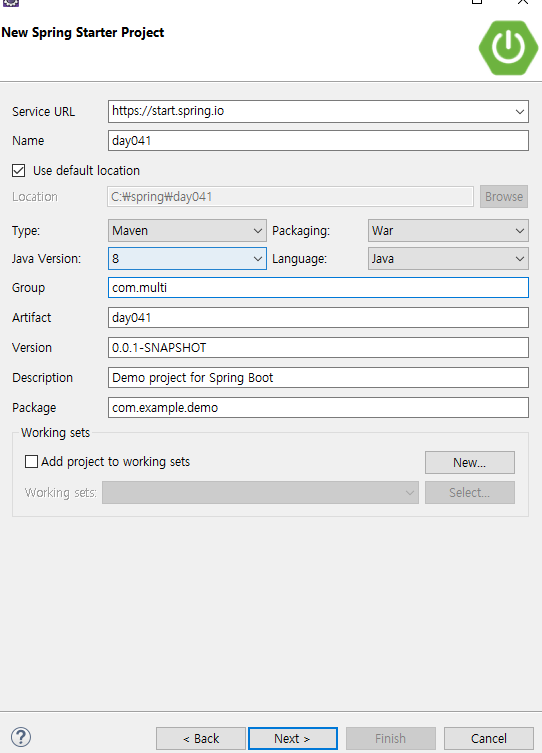
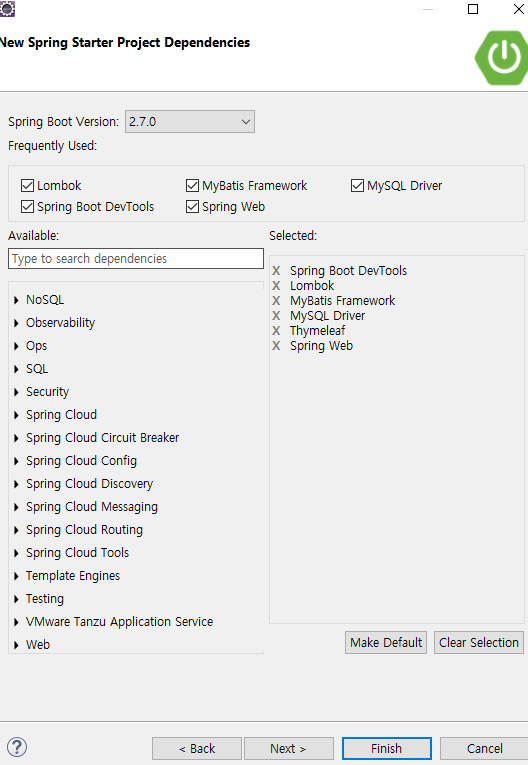

# 6/2 Spring Framework Day 04

## SPRINGBOOT

> DI, AOP의 정의와 차이점
>
> ### 1. DI(Dependency )
>
> - 의존성 주입
>
> ### 2.AOP (Aspect Oriented Programming)
>
> 1. xml
> 2. anotation
>
> ### 3. SPRING + Mybatis

### 1. SPRING BOOT를 활용하여 웹환경과 DB를 연결

#### SpringBoot Web Application 환경 셋팅


#### 1. Spring Starter Project 설정

- Java Version 8로 수정
- Packging War로 수정
- Group, Pakage 수정



#### 2. Spring Starter Project Dependencies 설정

##### :heavy_check_mark:체크하기

1. Lombok
2. MyBatis Framework
3. MySQL Driver
4. Spring Boot DevTools
5. Spring Web
6. Thymeleaf



#### 3. pom.xml 추가

```xml
<!-- @Inject -->
		<dependency>
			<groupId>javax.inject</groupId>
			<artifactId>javax.inject</artifactId>
			<version>1</version>
		</dependency>
		<!-- Servlet -->

		<dependency>
			<groupId>org.apache.tomcat.embed</groupId>
			<artifactId>tomcat-embed-jasper</artifactId>
			<scope>provided</scope>
		</dependency>


		<dependency>
			<groupId>javax.servlet</groupId>
			<artifactId>javax.servlet-api</artifactId>
			<version>3.0.1</version>
			<scope>provided</scope>
		</dependency>
		<dependency>
			<groupId>javax.servlet</groupId>
			<artifactId>jstl</artifactId>
			<version>1.2</version>
		</dependency>
		
		<!-- json request -->   

		<dependency>
			<groupId>com.googlecode.json-simple</groupId>
			<artifactId>json-simple</artifactId>
			<version>1.1</version>
  		</dependency>
```

#### 4. src/main/resources 에 applications.properties 파일 수정 (반드시 메모장으로 열것)

```xml
server.port=80

spring.datasource.driverClassName=com.mysql.cj.jdbc.Driver
spring.datasource.url=jdbc:mysql://127.0.0.1:3306/shopdb?serverTimezone=Asia/Seoul

spring.datasource.username=admin1
spring.datasource.password=111111

mybatis.type-aliases-package=com.multi.vo
mybatis.mapper-locations=com/multi/mybatis/*.xml
```

### 5. vo.java 파일 생성 및 lombok 설정

- lombok 설치 안된다면 복사 후 설정
- eclipse폴더에 lombok.jar 설치
- eclipse.ini 에 최 하단에 해당문구 삽입

```
-javaagent:C:\eclipse\lombok.jar
```

```java
package com.multi.vo;

import lombok.AllArgsConstructor;
import lombok.Getter;
import lombok.NoArgsConstructor;
import lombok.Setter;
import lombok.ToString;

@Getter
@Setter
@AllArgsConstructor
@NoArgsConstructor
@ToString
public class CustVO {
	private String id;
	private String pwd;
	private String name;
}
```

#### 6. applications.properties에 설정한 값에 따라 패키지 생성

##### src/main/java

- com.multi.biz
  - CustBiz.java

```java
package com.multi.biz;

import java.util.List;

import org.springframework.beans.factory.annotation.Autowired;
import org.springframework.stereotype.Service;

import com.multi.frame.Biz;
import com.multi.mapper.CustMapper;
import com.multi.vo.CustVO;

@Service("custbiz")
public class CustBiz implements Biz<String,CustVO>{

	@Autowired
	CustMapper dao;
	
	@Override
	public void register(CustVO v) throws Exception {
		dao.insert(v);
	}

	@Override
	public void modify(CustVO v) throws Exception {
		dao.update(v);
	}

	@Override
	public void remove(String k) throws Exception {
		dao.delete(k);
	}

	@Override
	public CustVO get(String k) throws Exception {
		return dao.select(k);
	}

	@Override
	public List<CustVO> get() throws Exception {
		return dao.selectall();
	}

}
```

- com.multi.controller
  - MainController.java

```java
package com.multi.controller;

import org.springframework.stereotype.Controller;
import org.springframework.web.bind.annotation.RequestMapping;

@Controller
public class MainController {
	
	@RequestMapping("/")
	public String main() {
		return "main";
	}

}
```

- com.multi.frame
  - Biz.java

```java
package com.multi.frame;

import java.util.List;

public interface Biz<K,V> {
	public void register(V v) throws Exception;
	public void modify(V v) throws Exception;
	public void remove(K k) throws Exception;
	public V get(K k) throws Exception;
	public List<V> get() throws Exception;
}
```

- com.multi.mapper
  - CustMapper.java

```java
package com.multi.frame;

import java.util.List;

public interface Biz<K,V> {
	public void register(V v) throws Exception;
	public void modify(V v) throws Exception;
	public void remove(K k) throws Exception;
	public V get(K k) throws Exception;
	public List<V> get() throws Exception;
}
```

- com.multi.mybatis
  - custmapper.xml

```xml
<?xml version="1.0" encoding="UTF-8"?>
<!DOCTYPE mapper
PUBLIC "-//mybatis.org/DTD Mapper 3.0//EN"
"http://mybatis.org/dtd/mybatis-3-mapper.dtd">
<mapper namespace="com.multi.mapper.CustMapper">
	
	<select id="select" parameterType="String" resultType="custVO">
		SELECT * FROM CUST WHERE ID=#{id}
	</select>
	<select id="selectall" resultType="custVO">
		SELECT * FROM CUST
	</select>
	<insert id="insert" parameterType="custVO">
		INSERT INTO CUST VALUES (#{id},#{pwd},#{name})
	</insert>
	<update id="update" parameterType="custVO">
		UPDATE CUST SET PWD=#{pwd},NAME=#{name} WHERE ID=#{id}
	</update>
	<delete id="delete" parameterType="String">
		DELETE FROM CUST WHERE ID=#{id}
	</delete>
	<select id="searchname" parameterType="String" resultType="custVO">
		SELECT * FROM CUST WHERE NAME LIKE CONCAT('%',#{name},'%')
	</select>
</mapper>
```

- com.multi.vo
  - CustVO.java

```java
package com.multi.vo;

import lombok.AllArgsConstructor;
import lombok.Getter;
import lombok.NoArgsConstructor;
import lombok.Setter;
import lombok.ToString;

@Getter
@Setter
@AllArgsConstructor
@NoArgsConstructor
@ToString
public class CustVO {
	private String id;
	private String pwd;
	private String name;
}
```

#### 7. 인터페이스와 controller를 이용하여 web연결 및 회원정보 db로 전송

- MainController.java

```java
package com.multi.controller;

import org.springframework.beans.factory.annotation.Autowired;
import org.springframework.stereotype.Controller;
import org.springframework.web.bind.annotation.RequestMapping;

import com.multi.biz.CustBiz;
import com.multi.vo.CustVO;

@Controller
public class MainController {
	@Autowired
	CustBiz biz;
	
	@RequestMapping("/")
	public String main() {
		return "main";
	}
	@RequestMapping("/custadd")
	public String custadd() {
		return "custadd";
	}
	@RequestMapping("/custaddimpl")
	public String custaddimpl(CustVO cust) {
		String next = "custaddok";
		try {
			biz.register(cust);
		} catch (Exception e) {
			next = "custaddfail";
		}
		return next;
	}
	@RequestMapping("/custselect")
	public String custselect() {
		return "custselect";
	}

}
```

> th:
>
> 

- custselect.html
  - th:each는 for each를 html에 쓰는것과 동일
  - th는 팀리프의 약자

```html
<!DOCTYPE html>
<html xmlns:th="http://www.thymeleaf.org">
<head>
<meta charset="UTF-8">
<title>Insert title here</title>
</head>
<body>
	<h1>Cust SELECT</h1>
	<div th:each="cust : ${allcust}">
		<h2 th:text="${cust.id} +${cust.name}"></h2>
	</div>
</body>
</html>
```

- thymeleaf로 링크거는법

```html
<td><a href="custdetail" th:href="@{/custdetail(id=${c.id)}" th:text="${c.id}">ID</a></td>
```

### :pencil2:Today workshop

1. ProductBiz, ProductMapper 만든다.
2. 모든 기능을 Test 한다.
3. 화면과 연동 한다.


> select와 selectALL테스트와 페이지 만들기는 저녁에~!
