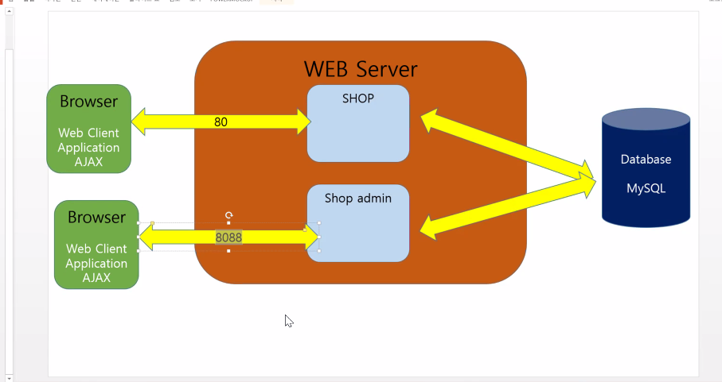

# 6/8 Spring Framework Day 07

## SPRINGBOOT

### 1. Group By 를 이용한 결과 값 DB에서 얻기

- AVGVO.java 추가

```java
package com.multi.vo;

import lombok.AllArgsConstructor;
import lombok.Getter;
import lombok.NoArgsConstructor;
import lombok.Setter;
import lombok.ToString;

@Getter
@Setter
@AllArgsConstructor
@NoArgsConstructor
@ToString
public class ProductAVGVO {
	private String catename;
	private double avg;
}
```

- mapper.xml 추가

```xml
<select id ="selectall3" resultType="ProductAVGVO">
    SELECT c1.name as catename, avg(p.price) as avg from product p
    INNER JOIN cate c1 ON p.cid = c1.id
    GROUP BY catename;
</select>
```

- Mapper.java 추가

```java
public List<ProductAVGVO> selectall3() throws Exception;
```

- biz.java 추가

```java
public List<ProductAVGVO> get3() throws Exception {
		return biz.selectall3();
	}
```

### 2. 이미지와 같은 환경 만들기



#### Shop admin project 추가

- 프로젝트 properties - Web Project Settings
  - Context root : shopadmin