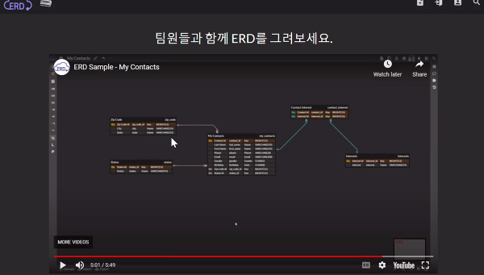

# 4/28 SQL Day1

> 시험장에 몰래 가져갈 이경오의 SQL+SQLD 비밀노트

## SQL

### 1. 시스템 구축 - MySQL

### 2. DDL, DML

- DDL : CREATE, DROP, ALTER ,,
- DML : SELECT, INSERT, DELETE, UPDATE, ...

### 3. ERD

- 요구사항 정의
- 테이블을 설계 하고 구축

#### 관계형 DBMS

- RDBMS 

  - 

  - 현업에서 가장 많이 쓴다
  - 단점 : 시스템 자원을 많이 차지해서 시스템이 전반적으로 느려지는 것

- SQL(Structured Query Language)
  - 관계형 데이터베이스에서 사용되는 언어
- MySQL
  - Orcle사에서 제작한  DBMS 소프트웨어

#### ch03 MySQL 전체 운영 실습

- 정보시스템 구축하기 위한 단계
  - 기획, 분석, 설계, 구현, 시험 , 유지보수

#### View 

- 가상의 테이블

- ```sql
  CREATE VIEW v_emp
  AS
  SELECT empno, empname FROM emp;
  
  SELECT * FROM v_emp;
  ```

#### 명령프롬프터로 MySQL 들어가기

- ```
  mysql -u admin1 -p //mysql 들어가기
  Enter password : //패스터워드입력
  use companydb; // 데이터 베이스 들어가기
  Database changed
  show tables; // 테이블 보여줘라
  source dump.sql // 입력된 파일을 백업
  ```

#### Ch06 SQL기본

- ```sql
  -- SELECT 구문
  -- AS는 ALIAS의 약자로 컬렴명을 변경
  SELECT empno,empname,salary,salary * 0.2 AS fee FROM emp;
  ```

1. 데이터베이스 생성 - sqldb
2. sqlDB.sql을 import하시오

- WHERE 절

```SQL
SELECT * FROM usertbl
WHERE addr = '서울' -- 특정 정보만 가져온다
AND birthYear > 1970
AND mobile1 IS NOT NULL;

SELECT * FROM usertbl
WHERE height > 170 OR birthYear < 1970;

SELECT * FROM usertbl
WHERE height = 182;

SELECT * FROM usertbl
WHERE height >= 180 AND height <= 183;

SELECT * FROM usertbl
WHERE height BETWEEN 180 AND 183;

SELECT * FROM usertbl
WHERE height = 182 OR height = 170 OR height = 172;

SELECT * FROM usertbl
WHERE height IN (182,170,172);  -- 위에 문단과 같은 동작

SELECT * FROM usertbl
WHERE date_format(mDate,'%Y') < '2010'; 

-- 가입 년도가 2005년과 2008년 사이에 회원을 조회 하시오
SELECT * FROM usertbl
WHERE date_format(mDate,'%Y') BETWEEN '2005' AND '2008';
-- 가입 년도가 2007, 2009 년인 회원을 조회하시오 
SELECT * FROM usertbl
WHERE date_format(mDate,'%Y') IN (2007,2009);
-- 가입 월이 04월, 07월인 회원을 조회하시오
SELECT * FROM usertbl
WHERE date_format(mDate,'%m') IN ('04','07');
-- %Y %m %d %H %i %s 연 월 일 시 분 초
SELECT * FROM usertbl
WHERE name LIKE '%김%';
SELECT * FROM usertbl
WHERE name LIKE '_종%';

-- 윤종신 회원과 같은 지역의 회원을 조회 하시오

SELECT addr FROM usertbl
WHERE name = '윤종신';

SELECT * FROM usertbl
WHERE addr = (SELECT addr FROM usertbl
WHERE name = '윤종신');

-- 윤종신 회원보다 키가 큰 회원을 조회 하시오
SELECT * FROM usertbl
WHERE height > (SELECT height FROM usertbl WHERE name = '윤종신');

-- 경남 지역의 회원들 키와 동일한 회원들을 조회 하시오
SELECT * FROM usertbl
WHERE height IN (SELECT height FROM usertbl 
WHERE addr = '경남');

SELECT * FROM usertbl 
ORDER BY height DESC, name ASC; -- ASC : 작은순부터 오름 차순 / DESC : 내림차순

SELECT * FROM usertbl 
ORDER BY 3 DESC, 2 ASC; -- 번호는 콜롬(열) 값을 나타냄

SELECT * FROM usertbl
WHERE addr = '서울'
AND birthYear < 1980
ORDER BY name; -- ORDER BY 는 맨 뒤에 위치하는것. 원하는 순서대로 출력

SELECT DISTINCT addr FROM usertbl; -- DISTINCT : 중복된 것은 하나만 남긴다 / 대부분 1개의 컬럼만 제시한다

SELECT * FROM usertbl
ORDER BY height LIMIT 2,5; -- LIMIT : 출력하는 개수를 제한 

```

