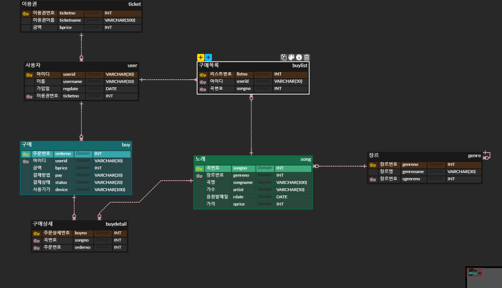

# 5/3 SQL Day4

## DAY3복습

- SUB QUERY
- JOIN
  - INNER JOIN
  - OUTER JOIN

- 

## Ch08 테이블과 뷰

> 핵심개념
>
> 1. 테이블의 생성 (DDL문)
> 2. 제약 조건 : 기본 키, 외래 키 등
> 3. 테이블 왑축과 효율성 및 임시 테이블의 화룡ㅇ
> 4. 뷰의 개념과 장단점

### 명령 프롬프터 SQL 명령어 정리

- mysql -u admin1 -p : sql 접속
- SHOW DATABASES; 데이터베이스본다
- SHOW TABLES; 테이블은 본다
- USE SHOPDB; 이동한다
- DESC itemdb;

> Idea! MUSIC 스트리밍 사이트 데이터베이스 
>
> 플레이리스트 테이블 == CART
>
> 곡들 테이블 == PRODUCT
>
> 고객 테이블 == CUST
>
> 장르 테이블 == CATE

#### 1. SQL을 이용해서 테이블을 생성

```sql
-- DDL
DROP SCHEMA IF EXISTS shoppingdb;
CREATE SCHEMA shoppingdb;
USE shoppingdb;

DROP TABLE IF EXISTS cart;
DROP TABLE IF EXISTS cust;
DROP TABLE IF EXISTS product;
DROP TABLE IF EXISTS cate;

CREATE TABLE cust(
	id VARCHAR(10),
    name VARCHAR(20),
    addr VARCHAR(100),
    regdate DATE
);
CREATE TABLE cate(
	id INT,
    name VARCHAR(10),
    pid INT
);
CREATE TABLE product(
	id INT ,
    name VARCHAR(20),
    price INT,
	regdate DATE,
    cid INT
);
CREATE TABLE cart(
	id INT,
    uid VARCHAR(10),
    pid INT,
    regdate DATE
);
```

#### 2. 제약조건

- 기본키 제약 조건
  - Primary Key

```sql
-- DDL
DROP SCHEMA IF EXISTS shoppingdb;
CREATE SCHEMA shoppingdb;
USE shoppingdb;

DROP TABLE IF EXISTS cart;
DROP TABLE IF EXISTS cust;
DROP TABLE IF EXISTS product;
DROP TABLE IF EXISTS cate;

-- cust table

CREATE TABLE cust(
	id VARCHAR(10),
    name VARCHAR(20),
    addr VARCHAR(100),
    regdate DATE
);

ALTER TABLE cust                -- cust 테이블을 변경
ADD CONSTRAINT PRIMARY KEY(id);

-- cate table

CREATE TABLE cate(
	id INT,
    name VARCHAR(10),
    pid INT
);

ALTER TABLE cate
ADD CONSTRAINT PRIMARY KEY(id);

-- product table

CREATE TABLE product(
	id INT ,
    name VARCHAR(20),
    price INT,
	regdate DATE,
    cid INT
);

ALTER TABLE product
ADD CONSTRAINT PRIMARY KEY(id);

-- cart table

CREATE TABLE cart(
	id INT,
    uid VARCHAR(10),
    pid INT,
    regdate DATE
);

ALTER TABLE cart       
ADD CONSTRAINT PRIMARY KEY(id);
```

- 외래 키 제약 조건
  - Foreign Key

``` SQL
-- DDL
DROP SCHEMA IF EXISTS shoppingdb;
CREATE SCHEMA shoppingdb;
USE shoppingdb;

DROP TABLE IF EXISTS cart;
DROP TABLE IF EXISTS cust;
DROP TABLE IF EXISTS product;
DROP TABLE IF EXISTS cate;

-- cust table

CREATE TABLE cust(
	id VARCHAR(10),
    name VARCHAR(20),
    addr VARCHAR(100),
    regdate DATE
);

ALTER TABLE cust                -- cust 테이블을 변경
ADD CONSTRAINT PRIMARY KEY(id);

-- cate table

CREATE TABLE cate(
	id INT,
    name VARCHAR(10),
    pid INT
);

ALTER TABLE cate ADD CONSTRAINT PRIMARY KEY(id);
ALTER TABLE cate ADD CONSTRAINT 
FOREIGN KEY (pid) REFERENCES cate (id);

-- product table

CREATE TABLE product(
	id INT ,
    name VARCHAR(20),
    price INT,
	regdate DATE,
    cid INT
);

ALTER TABLE product ADD CONSTRAINT PRIMARY KEY(id);
ALTER TABLE product MODIFY id INT AUTO_INCREMENT; -- INT 값으로 자동 증가하여 설정한다
ALTER TABLE product AUTO_INCREMENT = 1000; -- AUTO_INCREMENT 의 초기값을 1000으로 설정한다.

ALTER TABLE product ADD CONSTRAINT FOREIGN KEY (cid)
REFERENCES cate (id);
-- cart table

CREATE TABLE cart(
	id INT,
    uid VARCHAR(10),
    pid INT,
    regdate DATE
);

ALTER TABLE cart ADD CONSTRAINT PRIMARY KEY(id);
ALTER TABLE cart MODIFY id INT AUTO_INCREMENT; -- INT 값으로 자동 증가하여 설정한다
ALTER TABLE cart AUTO_INCREMENT = 1000; -- AUTO_INCREMENT 의 초기값을 1000으로 설정한다.
ALTER TABLE cart ADD CONSTRAINT FOREIGN KEY (uid) 
REFERENCES cust (id); -- cart의 아이디가 cust의 id와 연결
ALTER TABLE cart ADD CONSTRAINT FOREIGN KEY (pid) 
REFERENCES cate (id); 
```

#### UNIQUE 제약 조건, CHECK 제약 조건, DEFAULT 정의

- UNIQUE
  -  중복되지 않는 유일한 값 (PRIMARY KEY와 비슷하지만 차이점은 NULL 값을 허용)
  - `ALTER TABLE cate ADD CONSTRAINT UNIQUE (name);` 
- CHECK
  - 데이터를 점검
  - `ALTER TABLE product ADD CONSTRAINT CHECK (price > 0); -- 데이터를 점검`
- DEFAULT
  - 값을 입력하지 않았을 때, 자동으로 입력되는 기본 값을 정의
  - `ALTER TABLE cust ALTER COLUMN addr SET DEFAULT 'Seoul';`

> 열의 이름 및 데이터 형식 변경
>
> `-- ALTER TABLE cate CHANGE COLUMN name name VARCHAR(30) NOT NULL; -- COLUMN의 설정 수정`

### 뷰

- 뷰는 일반 사용자 입장에서는 테이블과 동일하게 사용하는 개체
- 뷰 생성

```sql
-- Make View Table

CREATE VIEW v_cart  -- view 생성
AS
SELECT c.id,cu.id AS uid,cu.name AS uname,p.name AS pname,p.price, ca.name AS cname, c.regdate FROM cart c
INNER JOIN cust cu ON c.uid = cu.id
INNER JOIN product p ON c.pid = p.id
INNER JOIN cate ca ON ca.id = p.cid;

UPDATE cart SET regdate = '2020-05-03' WHERE id = 1000;
SELECT * FROM v_cart; -- view 보기
```

- 뷰는 원하면 데이터 수정
  - `UPDATE v_cart SET regdate = '2019-05-04' WHERE id = 1001;`
- 뷰의 장점
  - 보안에 도움이 된다
  - 복잡한 쿼리를 단순화 시켜 줄 수 있다.
    - 그냥 테이블 이라고 생각하고 접근하면 된다.
    - WHERE절도 사용할 수 있다.
    - `SELECT * FROM v_cart
      WHERE uid = 'id01';`

[창시자 앨런 케이가 말하는, 객체 지향 프로그래밍의 본질 (velog.io)](https://velog.io/@eddy_song/alan-kay-OOP)


ERD 스트리밍 서비스 구축

