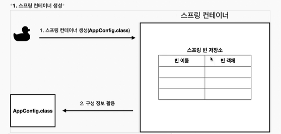
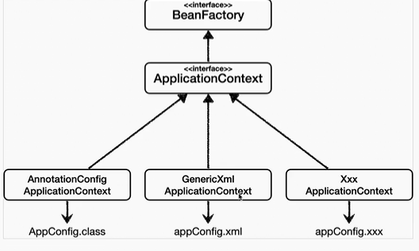

# 22/12/27 Spring Basic Day02

## Inflearn 스프링 입문

> 김영한
>
> 강의 목차
>
> 1. 객체 지향 설계와 스프링
> 2. 스프링 핵심 원리 이해1 - 예제 만들기
> 3. 스프링 핵심 원리 이해2 - 객체 지향 원리 적용
> 4. 스프링 컨테이너와 스프링 빈
> 5. 싱글톤 컨테이너
> 6. 컴포넌트 스캔
> 7. 의존관계 자동 주입
> 8. 빈 생명주기 콜백
> 9. 빈 스코프

- 역할과 구현을 분리해서 자유롭게 구현 객체를 조립할 수 있게 설계, 덕분에 회원 저장소는 물론, 할인 정책도 유연하게 변경할 수 있다.

## 스프링 핵심 원리 이해2 - 객체 지향 원리 적용

~~*컴퓨터 블루스크린으로 인한 정리 내용 다 날아감*~~

## 스프링 컨테이너와 스프링 빈

### 스프링 컨테이너 생성

```java
//스프링 컨테이너 생성
ApplicationContext applicationContext = new AnnotationConfigApplicationContext(AppConfig.class);
```

- 스프링 컨테이너는 XML을 기반으로 만들 수 있고, 애노테이션 기반의 자바 설정 클래스로 만들 수 있다.
- 직전 `AppConfig`를 사용했던 방식이 애노테이션 기반의 자바 설정 클래스로 스프링 컨테이너를 만든 것

> 참고 : 더 정확히 스프링 컨테이너를 부를 때 `BeanFactory` , `ApplicationContext`로 구분해서 이야기한다. `BeanFactory`를 직접 사용하는 경우는 거의 없으므로 일반적으로 `ApplicationContext` 를 스프링 컨테이너라 한다

### 스프링 컨테이너의 생성 과정

1. 스프링 컨테이너 생성



- `new AnnnotationConfigApplicationContext(AppConfig.class)`
- 스프링 컨테이너를 생성할 때는 구성 정보를 지정해 주어야 한다.
- 여기서는 `AppConfig.class`를 구성 정보로 지정

2. 스프링 빈 등록

- 스프링 컨테이너는 파라미터로 넘어온 설정 클래스 정보를 사용해서 스프링 등을 등록
- 빈 이름은 메서드 이름을 사용
- 빈 이름을 직접 부여할 수 도있다.
  - `@Bean(name=memberService2)`
- 빈 이름은 항상 다른 이름을 부여

3. 스프링 빈 의존관계 설정 - 준비
4. 스프링 빈 의존관계 설정 - 완료

- 스프링 컨테이너는 설정 정보를 참고해서 의존관계를 주입
- 단순히 자바 코드를 호출하는 것 같지만 차이가 있다.
- 참고
  - 스프링은 빈을 생성하고, 의존관계를 주입하는 단계가 나누어져 있다. 그런데 이렇게 자바 코드로 스프링 빈을 등록하면 생성자를 호출하면서 의존관계주입도 한번에 처리된다.
- 정리
  - 스프링 컨테이너를 생성하고, 설정(구성) 정보를 참고해서 스프링 빈도 등록하고, 의존관계도 설정.
  - 스프링 컨테이너에서 데이터를 조회

### 컨테이너 등록한 모든 빈 조회

```java
package hello.core.beanfind;

import hello.core.AppConfig;
import org.junit.jupiter.api.DisplayName;
import org.junit.jupiter.api.Test;
import org.springframework.beans.factory.config.BeanDefinition;
import org.springframework.context.annotation.AnnotationConfigApplicationContext;

public class ApplicationContextInfoTest {

    AnnotationConfigApplicationContext ac = new AnnotationConfigApplicationContext(AppConfig.class);

    @Test
    @DisplayName("모든 빈 출력하기")
    void findAllBean(){
        String[] beanDefinitionNames = ac.getBeanDefinitionNames();
        for (String beanDefinitionName : beanDefinitionNames) {
            Object bean = ac.getBean(beanDefinitionName);
            System.out.println("name = " + beanDefinitionName +"object = " + bean);
        }
    }

    @Test
    @DisplayName("애플리케이션 빈 출력하기")
    void findApllicationBean() {
        String[] beanDefinitionNames = ac.getBeanDefinitionNames();
        for (String beanDefinitionName : beanDefinitionNames) {
            BeanDefinition beanDefinition = ac.getBeanDefinition(beanDefinitionName);
            if (beanDefinition.getRole() == BeanDefinition.ROLE_APPLICATION) {
                Object bean = ac.getBean(beanDefinitionName);
                System.out.println("name = " + beanDefinitionName + " object = " + bean);
            }
        }
    }
}
```

- 모든 빈 출력하기
  - 실행하면 스프링에 등록된 모든 빈 정보를 출력 가능
  - `ac.getBeanDefinitionNames()`: 스프링에 등록된 모든 빈 이름을 조회한다.
  - `ac.getBean()`: 빈 이름으로 빈 객체(인스턴스)를 조회
- 애플리케이션 빈 출력
  - 스프링이 내부에서 사용하는 빈은 제외하고, 내가 등록한 빈만 출력 가능
  - 스프링이 내부에서 사용하는 빈은 getRole()로 구분 가능
    - `ROLE_APPLICATION`: 일반적으로 사용자가 정의한 빈
    - `ROLE_INFRASTRUCTURE`: 스프링이 내부에서 사용하는 빈

### 스프링 빈 조회_ 기본

- 스프링 컨테이너에서 스프링 빈을 찾는 가장 기본적인 조회 방법
- `ac.getBean(빈이름, 타입)`
- `ac.getBean(타입)`

```java
package hello.core.beanfind;

import hello.core.AppConfig;
import hello.core.member.MemberService;
import hello.core.member.MemberServiceImpl;
import org.assertj.core.api.Assertions;
import org.junit.jupiter.api.DisplayName;
import org.junit.jupiter.api.Test;
import org.springframework.beans.factory.NoSuchBeanDefinitionException;
import org.springframework.context.annotation.AnnotationConfigApplicationContext;

import static org.assertj.core.api.Assertions.*;
import static org.junit.jupiter.api.Assertions.*;

public class ApplicationContextBasicFindTest {

    AnnotationConfigApplicationContext ac = new AnnotationConfigApplicationContext(AppConfig.class);

    @Test
    @DisplayName("빈 이름으로 조회")
    void findBeanByName(){
        MemberService memberService = ac.getBean("memberService",MemberService.class);
        assertThat(memberService).isInstanceOf(MemberServiceImpl.class);
    }

    @Test
    @DisplayName("이름 없이 타입으로만 조회")
    void findBeanByType(){
        MemberService memberService = ac.getBean(MemberService.class);
        assertThat(memberService).isInstanceOf(MemberServiceImpl.class);
    }
    @Test
    @DisplayName("구체 타입으로 조회")
    void findBeanByName2(){
        MemberService memberService = ac.getBean("memberService",MemberServiceImpl.class);
        assertThat(memberService).isInstanceOf(MemberServiceImpl.class);
    }
    
    @Test
    @DisplayName("빈 이름으로 조회X")
    void findBeanByNameX(){
//        ac.getBean("xxxxx",MemberService.class);
        assertThrows(NoSuchBeanDefinitionException.class, () -> ac.getBean("xxxxx", MemberService.class));
    }
}
```

### 스프링 빈 조회 - 동일한 타입이 둘 이상

- 타입으로 조회시 같은 타입의 스프링 빈이 둘 이상이면 오류 발생
- 빈 이름을 지정
- `ac.getBeansOfType()`을 사용하면 해당 타입의 모든 빈을 조회 가능

### 스프링 빈 조회 - 상속관계

- 부모 타입으로 조회하면, 자식 타입도 함께 조회
- 그래서 모든 자바 객체의 최고 부모인 `Object` 타입으로 조회하면, 모든 스프링 빈을 조회

### BeanFactory와 ApplicationContext

- BeanFactory
  - 스프링 컨테이너의 최상위 인터페이스
  - 스프링 빈을 관리하고 조회하는 역할을 담당
  - `getBean()`을 제공
  - 사용했던 대부분의 기능은 BeanFactory가 제공하는 기능
- ApplicationContext
  - BeanFactory 기능을 모두 상속받아서 제공 
  - 애플리케이션을 개발할 때는 빈은 관리하고 조회하는 기능은 물론이고, 수 많은 부가 기능이 필요
    - 메시지소스를 활용한 국제화 기능 : 한국에서 들어오면 한국어 등
    - 환경 변수 : 로컬, 개발, 운영등을 구분해서 처리
    - 애플리케이션 이벤트 : 이벤트를 발행하고 구독하는 모델을 편리하게 지원
    - 편리한 리소스 조회 : 파일, 클래스패스, 외부 등에서 리소스를 편리하게 조회

- 정리
  - ApplicationContext는 BeanFactory의 기능을 상속
  - ApplicationContext는 빈 관리 기능 + 편리한 부가 기능을 제공
  - BeanFactory를 직접 사용할 일은 거의없고 부가기능이 포함된 ApplicationContext를 사용
  - BeanFactory나 ApplicationContext를 스프링 컨테이너라 한다.

### 다양한 설정 형식 지원 - 자바 코드, XML

- 스프링 컨테이너는 다양한 형식의 설정 정보를 받아들일 수 있게 유연하게 설계
  - 자바 코드, XML, Groovy 등등



#### 애노테이션 기반 자바 코드 설정 사용

- `new AnnotationConfigApplicationContext(AppConfig.class)`

#### XML 설정 사용

- `GenericXmlApplicationContext`를 사용

```xml
<?xml version="1.0" encoding="UTF-8"?>
<beans xmlns="http://www.springframework.org/schema/beans"
       xmlns:xsi="http://www.w3.org/2001/XMLSchema-instance"
       xsi:schemaLocation="http://www.springframework.org/schema/beans http://www.springframework.org/schema/beans/spring-beans.xsd">

    <bean id="memberService" class="hello.core.member.MemberServiceImpl" >
        <constructor-arg name="memberRepository" ref="memberRepository" />
    </bean>
    <bean id="memberRepository" class="hello.core.member.MemoryMemberRepository"/>

    <bean id="orderService" class="hello.core.order.OrderServiceImpl">
        <constructor-arg name="memberRepository" ref="memberRepository"/>
        <constructor-arg name="discountPolicy" ref="discountPolicy"/>
    </bean>

    <bean id="discountPolicy" class="hello.core.discount.RateDiscountPolicy"/>
</beans>
```

- xml 기반의 `appConfig.xml` 스프링 설정 정보와 자바 코드로 된 `AppConfig.java` 설정 정보를 비교해보면 거의 비슷하다는 것을 알 수 있다.

### 스프링 빈 설정 메타 정보 - BeanDefinition

- `BeanDefinition` 추상화
  - 다양한 설정 형식을 지원
  - 역할과 구현을 개념적으로 나눈 것
    - XML을 읽어서 BeanDefinition을 만들면 된다.
    - 자바 코드를 읽어서 BeanDefinition을 만들면 된다.
    - 스프링 컨테이너는 BeanDefinition만 알면 된다.
- `BeanDefinition`을 설정 메타정보라한다.
  - `@Bean`,`<bean>`당 각각 하나씩 메타 정보가 생성
- 스프링 컨테이너는 이 메타정보 기반으로 스프링 빈을 생성
- `AnnotationConfigApplicationContext`는 `AnnotatedBeanDefinitionReader`를 사용해서 `Appconfig.class`를 읽고 `BeanDefinition`을 생성
- `GenericXmlApplicationContext`는 `XmlBeanDefinitionReader`를 사용해서 `appConfig.xml` 설정 정보를 읽고 `BeanDefinition`을 생성
- 새로운 형식의 설정 정보가 추가되면 xxxBeanDefinitionReader를 만들어서 `BeanDefinition`을 생성하면 된다.

#### BeanDefinition 살펴보기

- BeanDefinition 정보
  - BeanClassName : 생성할 빈의 클래스 명 (자바 설정 처럼 팩토리 역할의 빈을 사용하면 없음)
  - factoryBeanName : 팩토리 역할의 빈을 사용할 경우 이름
  - factoryMethodName : 빈을 생성할 팩토리 메서드 지정
  - Scope : 싱글톤(기본값)
  - lazyInit : 스프링 컨테이너를 생성할 때 빈을 생성하는 것이 아니라, 실제 빈을 사용할 때 까지 최대한 생성을 지연처리 하는지 여부
  - InitMethodName : 빈을 생성하고, 의존관계를 적용한 뒤에 호출되는 초기화 메서드 명
  - DestroyMethodName : 빈의 생명주기가 끝나서 제거하기 직전에 호출되는 메서드 명
  - Constructor arguments, Properties : 의존관계 주입에서 사용

- 정리
  - BeanDefinition을 직접 생성해서 스프링 컨테이너에 등록할 수 있다.
  - 하지만 실무에서 BeanDefinition을 직접 정의하거나 사용할 일은 거의 없다

## 싱글톤 컨테이너

### 웹 애플리케이션과 싱글톤

- 스프링은 태생이 기업용 온라인 서비스 기술을 지원하기 위해 탄생
- 대부분의 스프링 애플리케이션은 웹 애플리케이션, 물론 웹이 아닌 애플리캐이션도 개발 가능
- 웹 애플리케이션은 보통 여러 고객이 동시에 요청

```java
package hello.core.singleton;

import hello.core.AppConfig;
import hello.core.member.MemberService;
import org.assertj.core.api.Assertions;
import org.junit.jupiter.api.DisplayName;
import org.junit.jupiter.api.Test;

public class SingletonTest {

    @Test
    @DisplayName("스프링 없는 순수한 DI 컨테이너")
    void pureContainer(){
        AppConfig appConfig = new AppConfig();
        //1. 조회: 호출할 때 마다 객체를 생성
        MemberService memberService1 = appConfig.memberService();

        //2. 조회: 호출할 때 마다 객체를 생성
        MemberService memberService2 = appConfig.memberService();

        //참조값이 다른 것을 확인
        System.out.println("memberService1 = " + memberService1);
        System.out.println("memberService2 = " + memberService2);

        //memberService != memberService2
        Assertions.assertThat(memberService1).isNotSameAs(memberService2);
    }
}
```

- 스프링 없는 순수한 DI 컨테이너인 AppConfig는 요청을 할 때마다 객체를 새로 생성
- 고객 트래픽이 초당 100이 나오면 초당 100개 객체가 생성되고 소멸 -> 메모리 낭비가 심하다
- 해결방안 : 해당 객체가 딱 1개만 생성되고, 공유하도록 설계하면 된다 -> 싱글톤 패턴

### 싱글톤 패턴

- 클래스의 인스턴스가 딱 1개만 생성되는 것을 보장하는 디자인 패턴
- 그래서 객체 인스턴스를 2개 이상 생성하지 못하도록 막아야 한다.
  - private 생성자를 사용해서 외부에서 임의로 new 키워드를 사용하지 못하도록 막아야 한다.

```java
package hello.core.singleton;

public class SingletonService {

    private static final SingletonService instance = new SingletonService();

    public static SingletonService getInstance(){
        return instance;
    }

    private SingletonService(){
    }

    public void logic(){
        System.out.println("싱글톤 객체 로직 호출");
    }
}
```

1. static 영역에 객체 instance를 미리 하나 생성해서 올려둔다.
2. 이 객체 인스턴스가 필요하면 오직 `getInstance()` 메서드를 통해서만 조회할 수 있다. 이 메서드를 호출하면 같은 인스턴스를 반환한다.
3. 딱 1개의 객체 인스턴스만 존재해야 하므로, 생성자를 private로 막아서 혹시라도 외부에서 new 키워드로 객체를 만드는것을 막음

- private 으로 new 키워드를 막아둔다.
- 호출할 때 마다 같은 객체 인스턴스를 반환하는 것을 확인 할 수 있다.

> 참고 : 싱글톤 패턴을 구현하는 방법은 여러가지 있다. 여기서는 객체를 미리 생성해두는 가장 단순하고 안전한 방법을 선택

#### 싱글톤패턴 문제점

- 구현하는 코드 자체가 많이 들어간다
- 의존관계상 클라이언트가 구체 클래스에 의존 -> DIP를 위반
- 클라이언트가 구체 클래스에 의존해서 OCP 원칙을 위반할 가능성이 높다.
- 테스트 하기 어렵다
- 내부 속성을 변경하거나 초기화 하기 어렵다.
- private 생성자로 자식 클래스를 만들기 어렵다.
- 결론적으로 유연성이 떨어진다.
- 안티패턴으로 불리기도 한다.
