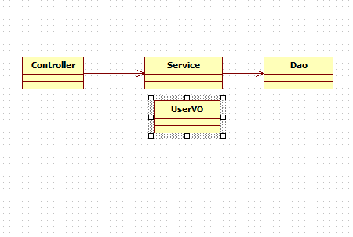
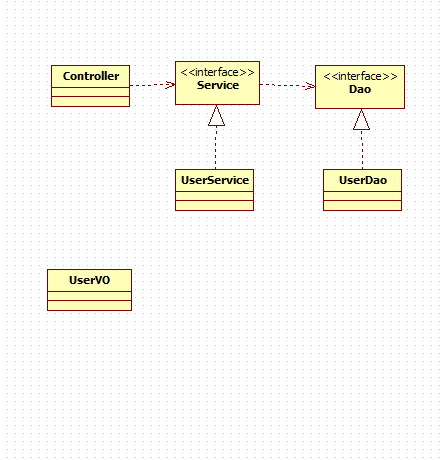

# 5/26 Spring Framework Day 01

## SPRING을 이용한 서비스 프로그래밍

### 1. 운영과 유지보수에 어려운 환경

> JDK란
>
> 책 : JAVA WEB을 다루는 기술



- Controller.java

```java
package com.multi;

public class Controller {

	public static void main(String[] args) {
		Service service = new Service();
		UserVO user = new UserVO("id01", "pwd01", "lee");
		
		service.register(user);
	}

}

```

- Dao.java

```java
package com.multi;

public class Dao {
	public void insert(UserVO user) {
		// SQL DB Insert
		System.out.println("Inserted : "+user);
	}
}

```

- Service.java

```java
package com.multi;

public class Service {
	Dao dao;
	
	public Service() {
		dao = new Dao();
	}
	
	public void register(UserVO user) {
		// Security, Log, Transaction
		dao.insert(user);
	}
}

```

- UserVO.java

```java
package com.multi;

public class UserVO {
	private String id;
	private String pwd;
	private String name;
	public UserVO() {
	}
	public UserVO(String id, String pwd, String name) {
		this.id = id;
		this.pwd = pwd;
		this.name = name;
	}
	public String getId() {
		return id;
	}
	public void setId(String id) {
		this.id = id;
	}
	public String getPwd() {
		return pwd;
	}
	public void setPwd(String pwd) {
		this.pwd = pwd;
	}
	public String getName() {
		return name;
	}
	public void setName(String name) {
		this.name = name;
	}
	@Override
	public String toString() {
		return "UserVO [id=" + id + ", pwd=" + pwd + ", name=" + name + "]";
	}
	
}

```

### 2. 클래스와 클래스 관계를 유연하게 만드는 방법



### 3. 스프링 환경설정

#### 1. 외부 스프링 라이브러리 가져오기

1. String_lib 폴더안 jar 파일 찾기
2. 프로젝트의 Properties들어가기
3. Java Build Path 에서 Libraries 들어가기
4. Add External JARs.. 클릭 후 모든 JAR파일 ADD 하기
5. Apply

#### 2. 스프링 xml 가져오기

```xml
<?xml version="1.0" encoding="UTF-8"?>
<beans xmlns="http://www.springframework.org/schema/beans" 
       xmlns:xsi="http://www.w3.org/2001/XMLSchema-instance" 
       xsi:schemaLocation="http://www.springframework.org/schema/beans http://www.springframework.org/schema/beans/spring-beans-3.0.xsd">
 
    <bean id="lg" class="bean.LgTV"/> 
    
</beans>
```

#### 3. Add Spring Project Nature

### 4. 메이븐을 통한 환경설정

#### 1. 프로젝트 오른쪽 클릭 후 confiqure

#### 2. convert to Maven

#### 3. porm.xml 생성

#### 4. porm.xml 수정

``` <properties>
<project xmlns="http://maven.apache.org/POM/4.0.0" xmlns:xsi="http://www.w3.org/2001/XMLSchema-instance" xsi:schemaLocation="http://maven.apache.org/POM/4.0.0 https://maven.apache.org/xsd/maven-4.0.0.xsd">
  <modelVersion>4.0.0</modelVersion>
  <groupId>day013</groupId>
  <artifactId>day013</artifactId>
  <version>0.0.1-SNAPSHOT</version>
  <build>
    <sourceDirectory>src</sourceDirectory>
    <plugins>
      <plugin>
        <artifactId>maven-compiler-plugin</artifactId>
        <version>3.8.1</version>
        <configuration>
          <source>1.8</source>
          <target>1.8</target>
        </configuration>
      </plugin>
    </plugins>
  </build>
  <!-- 여기서 부터 수정 -->
  <properties>
		<java-version>1.8</java-version>
        <org.springframework-version>4.2.5.RELEASE</org.springframework-version>
		<org.aspectj-version>1.6.5</org.aspectj-version>
		<org.slf4j-version>1.7.18</org.slf4j-version>
  </properties>
  <dependencies>
		<!-- Spring -->
		<dependency>
			<groupId>org.springframework</groupId>
			<artifactId>spring-context</artifactId>
			<version>${org.springframework-version}</version>
			<exclusions>
				<!-- Exclude Commons Logging in favor of SLF4j -->
				<exclusion>
					<groupId>commons-logging</groupId>
					<artifactId>commons-logging</artifactId>
				 </exclusion>
			</exclusions>
		</dependency>
		<dependency>
			<groupId>org.springframework</groupId>
			<artifactId>spring-webmvc</artifactId>
			<version>${org.springframework-version}</version>
		</dependency>
				<dependency>
			<groupId>org.springframework</groupId>
			<artifactId>spring-aop</artifactId>
			<version>${org.springframework-version}</version>
		</dependency>
		<dependency>
			<groupId>org.springframework</groupId>
			<artifactId>spring-beans</artifactId>
			<version>${org.springframework-version}</version>
		</dependency>
		<dependency>
			<groupId>org.springframework</groupId>
			<artifactId>spring-core</artifactId>
			<version>${org.springframework-version}</version>
		</dependency>
		<dependency>
			<groupId>org.springframework</groupId>
			<artifactId>spring-expression</artifactId>
			<version>${org.springframework-version}</version>
		</dependency>
		<dependency>
			<groupId>org.springframework</groupId>
			<artifactId>spring-jdbc</artifactId>
			<version>${org.springframework-version}</version>
		</dependency>
		<dependency>
			<groupId>org.springframework</groupId>
			<artifactId>spring-messaging</artifactId>
			<version>${org.springframework-version}</version>
		</dependency>
		<dependency>
			<groupId>org.springframework</groupId>
			<artifactId>spring-tx</artifactId>
			<version>${org.springframework-version}</version>
		</dependency>
		<!-- AspectJ -->
		<dependency>
			<groupId>org.aspectj</groupId>
			<artifactId>aspectjrt</artifactId>
			<version>${org.aspectj-version}</version>
		</dependency>	
		
		
		  <dependency>
			<groupId>org.aspectj</groupId>
			<artifactId>aspectjtools</artifactId>
			<version>${org.aspectj-version}</version>
		 </dependency>
		             
		  <dependency>
			<groupId>org.aspectj</groupId>
			<artifactId>aspectjweaver</artifactId>
			<version>${org.aspectj-version}</version>
		  </dependency>
		
		
		
		
		<!-- Logging -->
		<dependency>
			<groupId>org.slf4j</groupId>
			<artifactId>slf4j-api</artifactId>
			<version>${org.slf4j-version}</version>
		</dependency>
		<dependency>
			<groupId>org.slf4j</groupId>
			<artifactId>jcl-over-slf4j</artifactId>
			<version>${org.slf4j-version}</version>
			<scope>runtime</scope>
		</dependency>
		<dependency>
			<groupId>org.slf4j</groupId>
			<artifactId>slf4j-log4j12</artifactId>
			<version>${org.slf4j-version}</version>
		</dependency>
		<dependency>
			<groupId>log4j</groupId>
			<artifactId>log4j</artifactId>
			<version>1.2.15</version>
			<exclusions>
				<exclusion>
					<groupId>javax.mail</groupId>
					<artifactId>mail</artifactId>
				</exclusion>
				<exclusion>
					<groupId>javax.jms</groupId>
					<artifactId>jms</artifactId>
				</exclusion>
				<exclusion>
					<groupId>com.sun.jdmk</groupId>
					<artifactId>jmxtools</artifactId>
				</exclusion>
				<exclusion>
					<groupId>com.sun.jmx</groupId>
					<artifactId>jmxri</artifactId>
				</exclusion>
			</exclusions>
			<scope>runtime</scope>
		</dependency>

		<!-- @Inject -->
		<dependency>
			<groupId>javax.inject</groupId>
			<artifactId>javax.inject</artifactId>
			<version>1</version>
		</dependency>
				
		<!-- Servlet -->
       <dependency>
            <groupId>javax.servlet</groupId>
            <artifactId>javax.servlet-api</artifactId>
            <version>3.0.1</version>
            <scope>provided</scope>
        </dependency>
        <dependency>
            <groupId>javax.servlet</groupId>
            <artifactId>jstl</artifactId>
            <version>1.2</version>
        </dependency>
		<!-- Tiles3 -->
		<dependency>
            <groupId>org.apache.tiles</groupId>
            <artifactId>tiles-core</artifactId>
            <version>3.0.3</version>
        </dependency>
        <dependency>
            <groupId>org.apache.tiles</groupId>
            <artifactId>tiles-extras</artifactId>
            <version>3.0.3</version>
        </dependency>

		  <!-- MyBatis -->
		 <dependency>
		  <groupId>org.mybatis</groupId>
		  <artifactId>mybatis</artifactId>
		  <version>3.2.3</version>
		 </dependency>
		
		 <dependency>
		  <groupId>org.mybatis</groupId>
		  <artifactId>mybatis-spring</artifactId>
		  <version>1.2.2</version>
		 </dependency>
		 <!-- DBCP -->
		
		 <dependency>
		  <groupId>commons-dbcp</groupId>
		  <artifactId>commons-dbcp</artifactId>
		  <version>1.2.2</version>
		 </dependency>
		<!--  
		 <dependency>
		     <groupId>com.oracle</groupId>
		     <artifactId>ojdbc6</artifactId>
		     <version>11.2.0</version>
		 </dependency>
		 -->
			<!-- AOP Alliance -->
		<!-- Test -->
		<dependency>
			<groupId>junit</groupId>
			<artifactId>junit</artifactId>
			<version>4.7</version>
			<scope>test</scope>
		</dependency>
		<dependency>
			<groupId>commons-fileupload</groupId>
			<artifactId>commons-fileupload</artifactId>
			<version>1.3.1</version>
		</dependency>

		<dependency>
			<groupId>org.springframework</groupId>
			<artifactId>spring-jms</artifactId>
			<version>4.2.5.RELEASE</version>
		</dependency>

		<dependency>
			<groupId>aopalliance</groupId>
			<artifactId>aopalliance</artifactId>
			<version>1.0</version>
		</dependency>
		<dependency>
			<groupId>cglib</groupId>
			<artifactId>cglib</artifactId>
			<version>2.2</version>
		</dependency>
		<!-- json request -->   
		<dependency>
		   <groupId>com.fasterxml.jackson.core</groupId>
		   <artifactId>jackson-databind</artifactId>
		   <version>2.3.3</version>
		  </dependency>     
		 <dependency>
            <groupId>org.codehaus.jackson</groupId>
            <artifactId>jackson-mapper-asl</artifactId>
            <version>1.9.11</version>
        </dependency>
		 <dependency>
		 	<groupId>taglibs</groupId>
		 	<artifactId>standard</artifactId>
		 	<version>1.1.2</version>
		 </dependency>

		<dependency>
			<groupId>com.googlecode.json-simple</groupId>
			<artifactId>json-simple</artifactId>
			<version>1.1</version>
  		</dependency>
	</dependencies>
  
  
</project>
```

