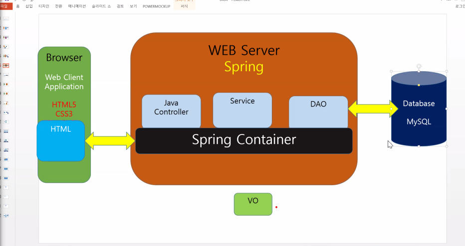

# 5/30 Spring Framework Day 02

## SPRING을 이용한 서비스 프로그래밍

### 1. 프레임 워크란?

- 건설현장에서 통용되던 용어
- 어떤 것을 구성하는 구조 또는 뼈대

### 2. Spring

1.DI(Dependency Injection)

1. XML
2. annotaytion

2.AOP(Aspect Oriented Programming)

1. XML
2. Annotation

3.Spring + Mybatis

1. pom.xml 에 mysql driver setting
2. spring.xml에 database 및 mybatis 관련 setting
3. mybatis.xml setting

3.Spring MVC

