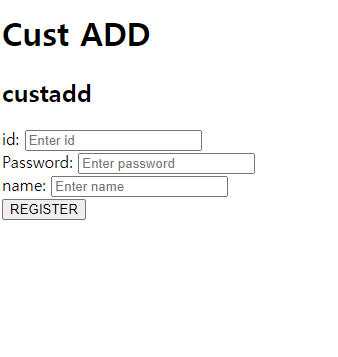
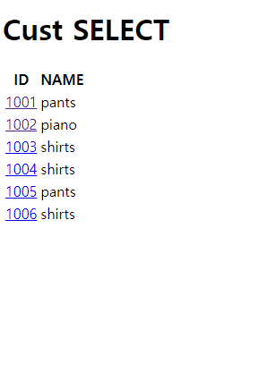
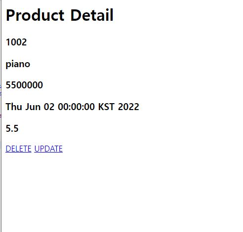

# 6/2 Spring Framework Day 04-1

## SPRINGBOOT

### :notebook_with_decorative_cover:workshop

#### CUST, PRODUCT CRUD Web으로 구현후 데이터베이스 연동 및 응용

- main page에서 add 와 전체항목 목록 보기가 가능하다.

- add로 데이터베이스 연동하여 데이터를 추가 할 수 있다.

- select으로 디테일한 항목을 볼 수 있다.

- detail에서 각 항목을 업데이트 및 지울 수 있다.
