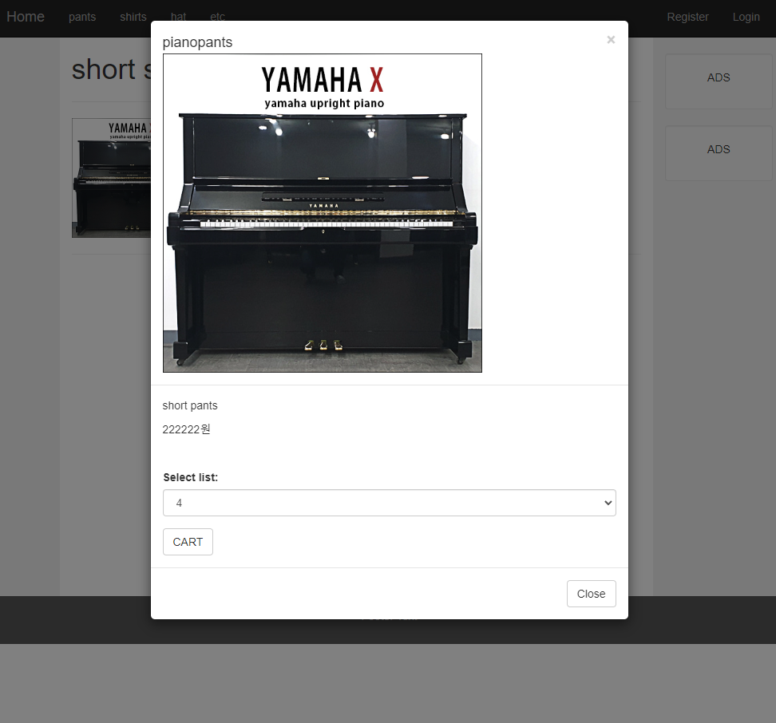

# 6/15 Spring Framework Day 12

## SPRINGBOOT

### 1. 세부 Product page 만들기

- 팀리프 2가지의 내용을 링크로 보내, 컨트롤러에서 받기는 콤마(,)를 사용한다.

  - ```html
    th:href="@{/getproduct(id=${m.id},name=${m.name})}" 
    ```

```html
<form>
		  	<div class="form-group">
			  <label for="sel1">Select list:</label>
			  <select class="form-control" id="sel1" name="cnt">
			    <option value="1">1</option>
			    <option value="2">2</option>
			    <option value="3">3</option>
			    <option value="4">4</option>
			  </select>
			</div>
			<button type="button" class="btn btn-default">CART</button>
		  </form>
```

### 2. Modal을 사용해 ORDER 작동시키기

> Modal : 원래있던 화면이 비활성화되고 새로운 화면이 기존화면에 활성화되는 것



## :star:[Thymeleaf] 기본 문법


```html
태그에 값 셋팅
<div th:text="${sports}"></div>
//sports가 옵젝일때
<div th:text="${sports.id}"></div>
//session 설정
<div th:text="${session.logincust.id}"></div>

태그에 값 셋팅 (연산)
<span th:text="${sports}-1"></span><span th:text="${sports-1}"></span>

html 태그가 들어있는 텍스트를 태그로 삽입하고 싶을 때
<p th:utext="${sports}"></p>
sports = "<span>TEST</span>";

문자열 합치기
<div th:text="'Hello, ' + ${name} + '!'"></div><div th:text="|Hello, ${name}!|"></div>

**value 값 셋팅**
<input type="hidden" th:value="${sports}"/>

**반복문**
<ul th:each="sports : ${SPORTS}">
   <li th:text="${sports['name']}"></li>
   <li th:text="${sports['event']}"></li>
</ul>

**if문**
// 한 가지 조건
<span th:if="${sports['name'] != null}">
// and 나 or 조건 추가
<span th:if="${sports['name'] != null and sports['name'] != ''}">
****
**if~else문**
<span th:if="${sports['count'] != '1'}">
<span th:unless="${sports['count'] != '1'}">
주의할 점은 unless 문은 if문과 같은 조건을 써주어야 한다는 것이다.
**switch case 문**
<td th:switch="${join.gender}">
<span th:case="'M'" th:text="Male"/>
<span th:case="'F'" th:text="Female"/></td>
*주의 : 서로 다른 케이스별로 딱 한번씩만 적용이 됨.
    
**이미지 태그에 src 속성**


**링크 url**
// 기본적인 링크 삽입
<a th:href="@{/index}"/>
// 고정된 url과 변수를 함께 사용할 때
<a th:href="${'http://www.naver.com' + sports}" target="_blank">링크</a>
// 링크에 파라미터를 보낼 때
<a th:href="@{/index(id=${id})}"/>
**onclick 함수에 값 전달** 
**<button th:onclick="addcart([[${p.id}]])" />**
```